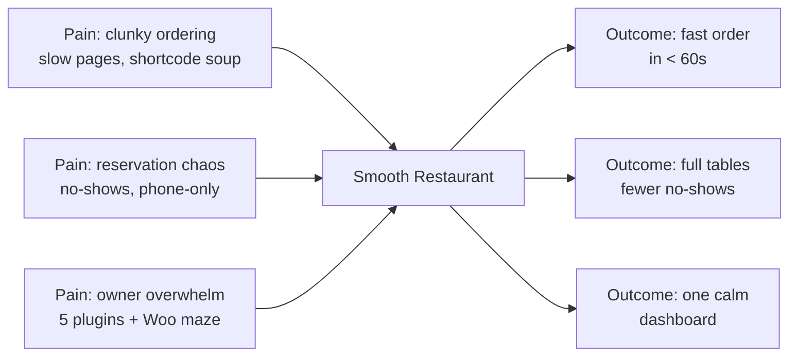

# 01 — Vision & Problem

> [!abstract] TL;DR
> **Smooth Restaurant** (smoothplugins.com — independent product, no relation to Arraytics/WPCafe) is the restaurant operating system for WordPress — menu, ordering, reservations, QR tableside and kitchen ops in one standalone plugin, with no WooCommerce, no commission and no hardware. Why now: incumbents (Orderable, WPCafe, GloriaFood) break on Woo updates, ship heavy shortcode frontends, and lock data hosted; Smooth is a better-in-every-sense standalone build that is agency-friendly, performance-centric (100 vitals, 50k users on 1 CPU/4GB), and live in <1 day.

## Whiteboard answers (Excalidraw, 2026-09-05) ✅ imported

| Question | Answer (founder) |
|----------|------------------|
| What problem? | Making restaurant management easier and profitable |
| Who for? | People involved in the food business → see [[03-personas-jtbd]] ICP |
| How? | Features + automating existing processes |
| Why? | Existing products fall short in 2 places: (1) not agency/developer friendly, (2) not performance-centric |
| How well? | 100 on web vitals; scale to 50k users on 1 CPU / 4GB RAM |

> [!success] Positioning (from board)
> High-performance restaurant management solution for WordPress agencies and developers.
> Agency/Developer bar: full documentation, API, headless support, AI-dev support.

## North-star ^north-star

> [!question] Founder decision (proposed in [[14-ideal-product]], needs sign-off)
> `For owners who lose money to phone chaos, slow pages, and 5-plugin maze, Smooth Restaurant is the restaurant operating system for WordPress that gets menu live in <1 day and diners paid in <60s — with no commission, no hardware, you own everything, at the highest technical performance.`
> - [x] Founder approves / edits the line above

## Problem → Outcome

## Who feels it most?

| Segment | Pain intensity (1-5) | Willingness to pay (1-5) | TODO note |
|---------|----------------------|--------------------------|-----------|
| Single-location dine-in | 5 (draft — phone chaos + no-shows) | 4 (draft — pays if Fri night saved) | validate in pilot |
| Takeaway / cloud kitchen | 5 (draft — speed = revenue) | 5 (draft — direct-order saves commission) | validate in pilot |
| Multi-branch / franchise | 4 (draft — chaos × locations) | 5 (draft — Pro Plus/Agency fit) | validate via agencies |

## Non-goals (say no early)

- [x] Not a generalized e-commerce replacement.
- [x] Not a hyper customizable and settings bloated platform on V1
- [x] Not an imitation of WPCafe
- [x] Not a theme.

> [!success] Founder call (2026-09-05, clarified 2026-09-06)
> Smooth = **independent product under smoothplugins.com — no relation to Arraytics/WPCafe** (founder previously worked at Arraytics). It is a better-in-every-sense standalone rival to all incumbents, not a lite sibling.
> Implication: must match full-suite breadth (menu, order, reservation) while winning on speed, UX, onboarding and excellent agency support.
>
> Context: founder has prior WPCafe domain knowledge (see `WPCafe/WPCafe.md` for lessons only — not affiliated).

## Success criteria (6 months)

| Metric | Target | Source | Note |
|--------|--------|--------|------|
| Install → activation → first menu live | **1,000 menus live (Y1)** | wp.org + telemetry | consistent with Y1 4K installs × 25% activated ([[13-business-plan#2. Revenue model math]]) |
| Core Web Vitals "good" on every Smooth surface | **≥95% of measured page loads** | RUM + PageSpeed | **clarified 2026-09-06** — the old "95+ on all metrics / 50%" was undefined: the target is a % of loads, not % of sites |
| Free → Pro conversion | **1.5% Y1 → 2% Y2+** | store | **corrected 2026-09-06** — was "1% >", which contradicted [[05-business-model-gtm]] and [[13-business-plan]] |
| Willingness-to-pay (pilots, n=3) | **≥2 of 3 say "yes, $149"** | founder interviews | the only committed pilot metric ([[07-roadmap-milestones]] M2) |

> [!note] Segment table above stays **draft**
> Pain/WTP scores (single-location dine-in 5/4, takeaway 5/5, multi-branch 4/5) remain **ASSUMPTIONs** until pilot willingness-to-pay interviews — 3 sites can validate direction, never rates.
