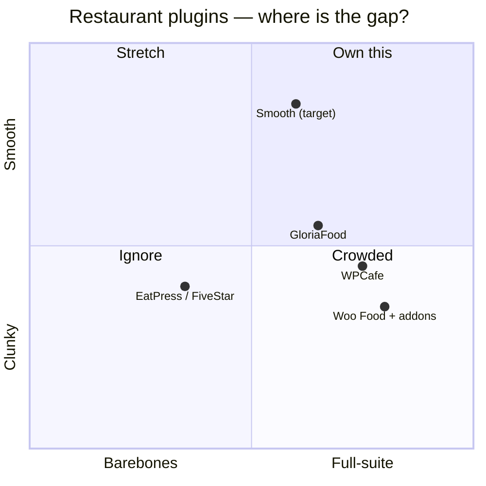
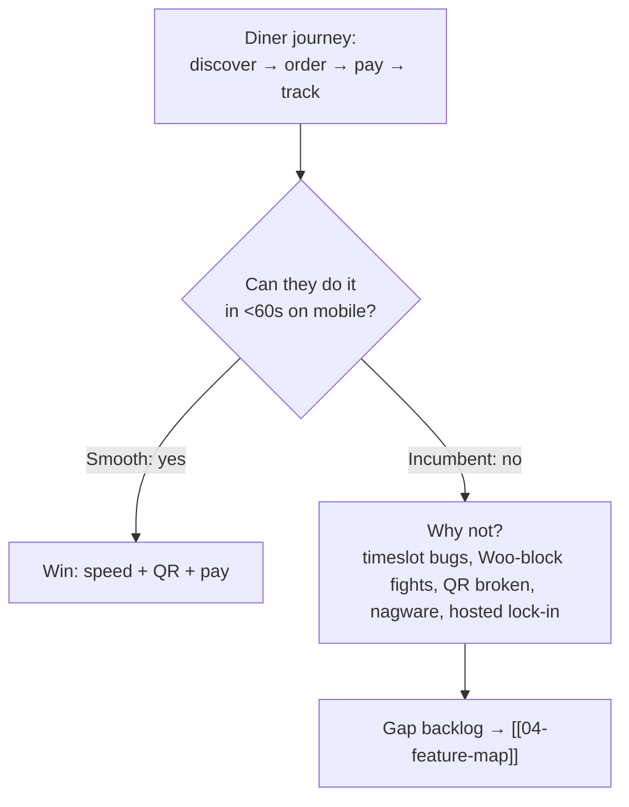

# 02 — Market & Competitors

> [!abstract] Goal
> Find the gap we can own. Tear down 3–5 incumbents, then position Smooth in one sentence.

## Positioning sketch

> [!success] Calibrated 2026-09-05 (from [[12-competitor-deep-dive]])
> - WPCafe [0.75, 0.45]: broadest suite, heaviest (~820K JS) + QR broken — full but clunky.
> - GloriaFood [0.65, 0.55]: free suite but hosted lock-in + stale since Apr 2025 — mid/mid.
> - EatPress / FiveStar [0.35, 0.40]: reservations/menu depth only, no ops — barebones + clunky.
> - Woo Food + addons [0.80, 0.35]: Orderable polished but Woo-update breakage + block-checkout fights — full but fragile.
> - Smooth (target) [0.60, 0.85]: narrower V1 than Woo-food, but standalone-native + working QR + capacity moat — own the Smooth half.

## Install base (wordpress.org, per ChatGPT research — re-verify before launch)

| Plugin                          | Active installs | Pricing signal                 | Strength                                                   | Weakness to exploit                              |
| ------------------------------- | --------------- | ------------------------------ | ---------------------------------------------------------- | ------------------------------------------------ |
| Five Star Reservations          | 10K+            | freemium                       | reservations depth                                         | ordering/ops thin                                |
| GloriaFood                      | 7K+             | free core, no commission pitch | free menu+order+reservations                               | hosted, WP ownership weak                        |
| Orderable                       | 5K+             | Pro ~$149/yr                   | polished order/delivery, date slots, ASAP                  | locations/QR/tips paywalled                      |
| WPCafe (Arraytics, external)  | 5K+             | freemium                       | broad: menu/order/booking, QR, KDS alerts, tables, loyalty | heavy (~820K JS), complexity, perf fixes ongoing |
| Five Star Menu                  | 5K+             | freemium                       | menu-first simplicity                                      | ops thin                                         |
| RestroFood                      | 5k+             | freemium                       | POS, branches, delivery, reservations, analytics           | not a true recipe/food-cost system               |
| DineKit / Libre Bite / FoodBook | 1k <            | freemium, low-review base       | QR, KDS, POS, loyalty, waitlist, CRM appearing             | Libre Bite POS online-only; offline gap open     |

> [!warning] Market-share / profit caveat
> wordpress.org gives install bands, not revenue. Profit data is private. Use installs + pricing-gate analysis as proxy; do not present bands as market share. Snapshot 2026-09-05 in [[12-competitor-deep-dive#Scoreboard]]: Five Star Res 10K+ / 94 (211) / 5% 1★ / 2026-08-20; GloriaFood 7K+ / 88 (54) / 7% 1★ / 2025-04-14 stale; Orderable 5K+ / 92 (40) / 2026-05-08; WPCafe 5K+ / 92 (109) / 8% 1★ / 2026-08-31; Five Star Menu 5K+ / 92 (107) / 2026-08-20.

## Feature-parity snapshot

## Pricing intel (sourced 2026-09-05 — see [[12-competitor-deep-dive]])

- [x] Capture free vs pro gates for each competitor — Orderable Pro $149/yr; Five Star 1-site €167 / 5-site €247 / Ultimate €297/yr; GloriaFood POS $49/mo + payments $29/mo; Square $0/$49/$149 per loc/mo + KDS $20–30/device/mo
- [x] Note commission / SaaS-fee traps (our wedge: **no commission**) — GloriaFood $29/mo payments + $49/mo POS; Square 2.6%+15¢ / 3.3%+30¢ + hardware rent; Toast quote+hardware lock-in
- [x] Note review volume + rating (wordpress.org) as proxy for distribution — Five Star Res 211×94 (leader), WPCafe 109×92, Five Star Menu 107×92, GloriaFood 54×88, Orderable 40×92

## Our wedge (founder draft)

> [!success] One-sentence wedge (locked from [[12-competitor-deep-dive#USP (post-research, final)]])
> "The restaurant operating system for WordPress — menu live in <1 day, diners paid in <60s, no commission, no hardware, you own everything, at highest speed."

## Sources (verify before launch)

- wp.org: [GloriaFood bridge](https://wordpress.org/plugins/menu-ordering-reservations/) · [Orderable](https://wordpress.org/plugins/orderable/) · [WPCafe](https://wordpress.org/plugins/wp-cafe/) · [Five Star Reservations](https://wordpress.org/plugins/restaurant-reservations/) · [Five Star Menu](https://wordpress.org/plugins/food-and-drink-menu/)
- Pricing: [Orderable](https://orderable.com/pricing/) · [GloriaFood](https://www.gloriafood.com/pricing) · [Five Star](https://www.fivestarplugins.com/plugins/five-star-restaurant-reservations/) · [Square](https://squareup.com/us/en/point-of-sale/restaurants/pricing) · [Toast](https://pos.toasttab.com/pricing)
- Deep teardown: [[12-competitor-deep-dive]]
