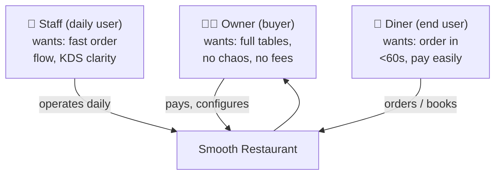
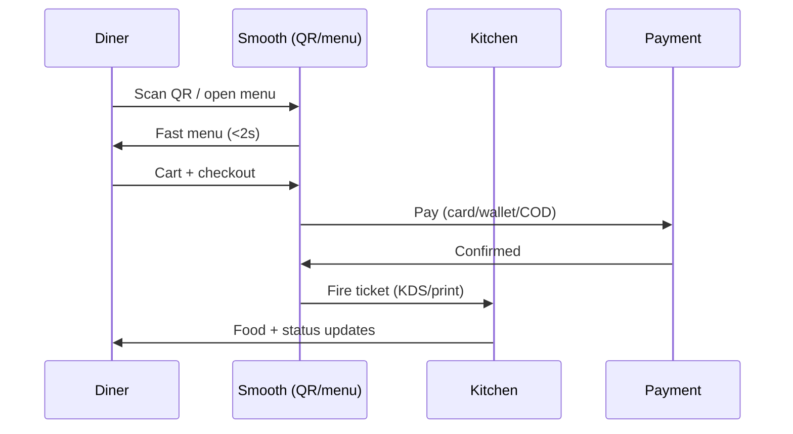

# 03 — Personas & JTBD

> [!abstract] Goal
> Name the buyer, the daily user, and the diner. If a feature serves none of them, it dies in [[04-feature-map]].

## ICP (whiteboard, 2026-09-05) ✅ imported

> Ideal Customer = anyone involved in the food business:
> i) Physical restaurant / café / food-truck owner, ii) Cloud kitchen, iii) Agency / Developer (channel + buyer).

> [!success] Confirmed broad 2026-09-06
> The founder deliberately **kept the ICP broad** (restaurants, cafés, food trucks, cloud kitchens, multi-branch, agencies) rather than narrowing. Implication for [[04-feature-map]]: no segment gets a dedicated V1 module — the **broad platform** (menu, ordering, reservations, QR) serves all of them, and depth arrives in M3/M5.
> Anti-personas (delivery fleets, enterprise POS integrators, Woo-commerce users, non-food businesses) remain the boundary — see below.

> [!warning] The segment that needs watching
> Takeaway / cloud kitchen has the highest stated willingness-to-pay ([[01-vision-problem]]) but its core needs are all **Free**. Their upgrade reason is **Pro = "run the rush"** (capacity-lite slots, honest prep-time, sales/product reports, pause/resume) — validated or refuted by pilot willingness-to-pay interviews, not assumed.

## Persona map

## JTBD (jobs-to-be-done) — starter set, edit freely

| Who   | Job                                                 | Today (painful workaround) | Success =                                                                 |
| ----- | --------------------------------------------------- | -------------------------- | ------------------------------------------------------------------------- |
| Owner | "Get Friday night fully booked without phone chaos" | Phone + paper + no-show    | Automate reservation handling                                             |
| Owner | "Launch online ordering this week, no dev"          | 5 plugins + Woo maze       | Setup food ordering in 10 minutes.                                        |
| Staff | "Fire orders to kitchen without re-typing"          | Print + shout              | Waiter takes the order once and clicks done everything else is automated. |
| Diner | "Order from table by QR, pay, leave"                | Wait for waiter            | <60s to paid                                                              |
| Diner | "Book a table in 3 taps"                            | Call during rush           | Instant confirm + reminder                                                |

## Diner journey (happy path)

## Anti-personas (ignored in V1 — confirmed 2026-09-05 per [[14-ideal-product#7. What is deliberately NOT in the ideal product]])

- [x] delivery-fleet operators.
- [x] enterprise POS integrators.
- [x] Woo commerce users.
- [x] Anyone outside the food business.

> [!tip] Founder check
> If torn between two features, ask: "Which persona's Friday night does this save?" Build that one.
