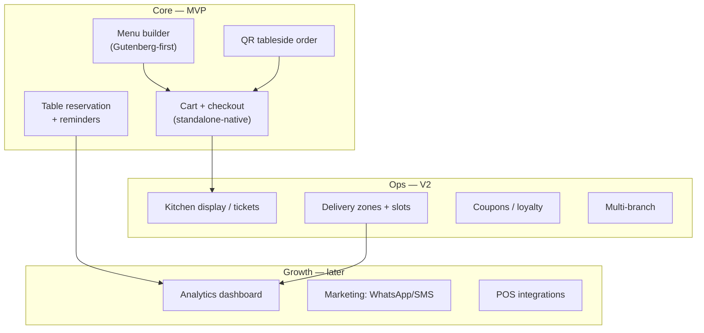
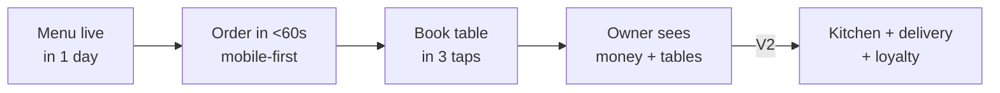

# 04 — Feature Map (MVP vs V2 vs Never)

> [!abstract] How to use
> This IS the scope decision. Move every candidate into **Must / Should / Could / Won't**.
> Rule: a Must serves a [[03-personas-jtbd|persona JTBD]] and the [[01-vision-problem#North-star|north-star]].

## Module map

## MoSCoW backlog (founder fill)

> [!success] Ships column = [[07-roadmap-milestones]]: **M1** money path (Wave 1 MVP) · **M3** launch engine (V2a) · **M5** V2b (first post-launch update) · **P2** later.

| Feature | Persona | Must/Should/Could | Free / Pro | Ships | Notes / dependency |
|---------|---------|-------------------|------------|-------|--------------------|
| Visual menu builder (blocks) | Owner, Diner | Must | Free | **M1** | Gutenberg-first (D3) |
| Cart + checkout (fast mobile, native block) | Diner | Must | Free | **M1** | standalone-native, no Woo — see [[15-standalone-strategy]] |
| Payments (Stripe, PayPal, wallets, COD — native) | Diner | Must | Free core | **M1** | SAQ-A; **PayPal is first in the pre-agreed cut order** |
| QR tableside ordering + table sessions | Diner, Staff | Must (QR-first MVP) | Pro Single | **M1** | **LOCKED 2026-09-06: pulled into MVP build** (Pro tier) — table-token + TTL row per D6 |
| Table reservation + reminders | Owner, Diner | Must (book Free; deposits/reminders Pro) | Free / Pro | **M1** lite → **M3** depth | QR-first lock: reservations stay MVP-lite |
| Pickup slots | Diner | Must | Free | **M1** | delivery + zones → M3 (Wave 1 ships pickup + QR dine-in only) |
| 86 flag (manual) | Owner, Staff | Must | Free | **M1** | cheap ops credibility |
| Diagnostics — minimal health badge | Owner | Must | Free | **M1** | full perf diagnostics → M3 (Pro) |
| Kitchen tickets / KDS-lite | Staff | Should | Pro | **M5** | not at launch |
| Coupons / happy-hour pricing | Owner | Should | **Free** | **M3** | parity with GloriaFood; weapon vs Orderable. (Was "Could/Could" — resolved Free, 2026-09-06) |
| Pause / resume ordering | Owner, Staff | Should | **Pro** | **M3** | **LOCKED 2026-09-06: Pro** — `15` wrongly listed it Free; fixed |
| Analytics — basic (today's sales, order list) | Owner | Must | Free | **M1** | dashboard |
| Analytics — sales + product reports, menu engineering | Owner | Should | **Pro** | **M3** | part of the Pro "run the rush" value |
| Capacity-lite slot caps + honest prep-time | Owner, Diner | Should | **Pro** | **M3** | **the reason a takeaway pays $149** (highest-WTP segment) |
| AI menu import (URL / PDF / photo → menu) | Owner | Should | Free | **M3** | replaces CSV + importer as the "menu live <1 day" weapon |
| Competitor importer (Orderable/WPCafe/CSV) | Owner | Should | Free | **M3** | acquisition; deferred out of M1 (locked 2026-09-06) |
| Delivery zones + distance fees | Owner, Diner | Should | Free | **M3** | deferred out of M1 with delivery |
| Deposits + reminders (SMS/WhatsApp, BYO) | Owner, Diner | Should | Pro | **M3** | anti-no-show revenue |
| Multi-location | Owner | **Could** (was Must) | Pro Plus / Agency | **M5** | **DOWNGRADED 2026-09-06 — not at launch.** Plus/Agency sell single-location site counts until M5 |
| Kitchen-load capacity throttle + live prep-time from load | Owner | Could | Pro | **M5** | XL moat bet ([[09-whitespace-gaps]]) |
| Advanced analytics + margins / recipe costing | Owner | Could | Pro | **M5** | moat, later |
| Offline-first KDS, ingredient auto-86, behavior CRM | Owner | Could | Pro | **P2** | later |
| _Imported from ChatGPT research — see P0/P1 tables below; no orphan rows_ | | | | | |

## Imported roadmap (ChatGPT research, 2026-09-05) — locked direction

> [!warning] Corrections applied 2026-09-06 (tier source of truth = [[13-business-plan#5. Pricing tiers recommendation]] + [[12-competitor-deep-dive#Unified feature list — tier + effort]])
> Rows changed from the ChatGPT original: "WooCommerce payments" → **native standalone payments**; "QR dine-in ordering Free" split into **QR menu view (Free)** + **QR table ordering/sessions (Pro Single)**. Read any other Woo reference as standalone-native.

### P0 baseline (market parity — must ship, mostly Free)

| Feature | Free / Pro | Importance | Impact |
|---------|------------|------------|--------|
| Menu builder (categories, items, images, prices) | Free | ⭐⭐⭐⭐⭐ | acquisition core |
| Variations & add-ons | Free | ⭐⭐⭐⭐⭐ | real-menu requirement |
| Pickup + delivery ordering | Free | ⭐⭐⭐⭐⭐ | revenue workflow |
| Mobile-first checkout | Free | ⭐⭐⭐⭐⭐ | conversion |
| Opening hours / availability | Free | ⭐⭐⭐⭐⭐ | ops essential |
| Scheduled + ASAP orders | Free | ⭐⭐⭐⭐⭐ | usability edge |
| Native payments (Stripe/PayPal/COD — standalone) | Free | ⭐⭐⭐⭐⭐ | own payment infra (see [[15-standalone-strategy#3. Payment strategy without Woo]]) |
| Order notifications / email | Free | ⭐⭐⭐⭐ | restaurant workflow |
| Order management dashboard | Free | ⭐⭐⭐⭐⭐ | usability |
| Coupons / basic discounts | Free | ⭐⭐⭐⭐ | acquisition |

### P1 differentiation + Pro engine

| Feature | Free / Pro | Importance | Impact |
|---------|------------|------------|--------|
| QR menu (dine-in view) | Free | ⭐⭐⭐⭐⭐ | differentiator; parity with GloriaFood |
| QR table ordering + table sessions | Pro Single | ⭐⭐⭐⭐⭐ | real restaurant system; WPCafe's broken promise — ship working |
| Reservations | Free | ⭐⭐⭐⭐⭐ | 10K+ proven demand |
| Visual floor plan | Pro | ⭐⭐⭐⭐⭐ | competitive gap |
| Reservation deposits | Pro | ⭐⭐⭐⭐ | anti-no-show revenue |
| Delivery zones + distance fees | Free | ⭐⭐⭐⭐⭐ | high value |
| Advanced delivery rules | Pro | ⭐⭐⭐⭐ | monetizable |
| Kitchen printing | Pro | ⭐⭐⭐⭐ | web → ops bridge |
| Kitchen display (KDS) | Pro | ⭐⭐⭐⭐⭐ | future moat |
| Order status workflow | Free | ⭐⭐⭐⭐ | usability |
| Tips | Pro | ⭐⭐⭐ | revenue |
| Advanced analytics / sales+product reports | Pro | ⭐⭐⭐⭐ | retention, upsell |
| Multi-location + branch menus/hours | Pro | ⭐⭐⭐⭐⭐ | higher ARPU |
| Customer accounts / history | Free | ⭐⭐⭐⭐ | retention base |
| Loyalty / rewards | Pro | ⭐⭐⭐⭐ | differentiation |
| Order bumps / upsells | Pro | ⭐⭐⭐⭐⭐ | AOV lift |
| Abandoned-order recovery | Pro | ⭐⭐⭐⭐ | revenue recovery |
| SMS notifications | Pro | ⭐⭐⭐⭐ | ops value |
| WhatsApp notifications | Pro | ⭐⭐⭐⭐⭐ | intl appeal |
| Gift cards / marketing automation | Pro (P2) | ⭐⭐⭐ | later |

### Performance = philosophy (all tiers unless noted)

Minimal conditional JS/CSS, no Elementor dependency, lightweight UI, efficient schema, cached menus/availability, REST/AJAX only where needed, background jobs, large-menu scale, diagnostics (Pro).

## V1 slice (founder-locked)

> [!danger] Scope guardrails
> - **M1 (Wave 1 MVP) = the money path only** — menu + variations, cart/checkout/totals, Stripe + PayPal + COD, orders + ledger, slots, email queue, dashboard + print, reservations-lite, QR table sessions, health badge. Everything else moves to M3/M5 (see Ships column). The old "MVP ≤ 14 features" rule is retired: the binding constraint is **founder hours (10–15 h/wk)**, so scope is governed by the **hour budget (250–350 h)** and the pre-agreed cut order in [[07-roadmap-milestones]].
> - Every Must needs an **exit criterion** in [[07-roadmap-milestones]].
> - WPCafe lesson: unconditional assets + shortcode soup killed speed — see `WPCafe/WPCafe.md`. Smooth defaults: conditional load, block-first.

## Open feature questions

- [x] WooCommerce required, optional, or replaced? → **LOCKED: standalone-native** ([[15-standalone-strategy]])
- [x] Reservation vs QR order? → **LOCKED 2026-09-06: QR-first** — QR table sessions in MVP; deposits/reminders + advanced reservation depth → V2
- [ ] Reservation: native tables ([[15-standalone-strategy#4. Storage|D4 = custom tables]]) — confirm schema in SRS
- [ ] QR ordering: table-token + TTL row ([[15-standalone-strategy#10. Decision log|D6]]) — confirm in SRS
