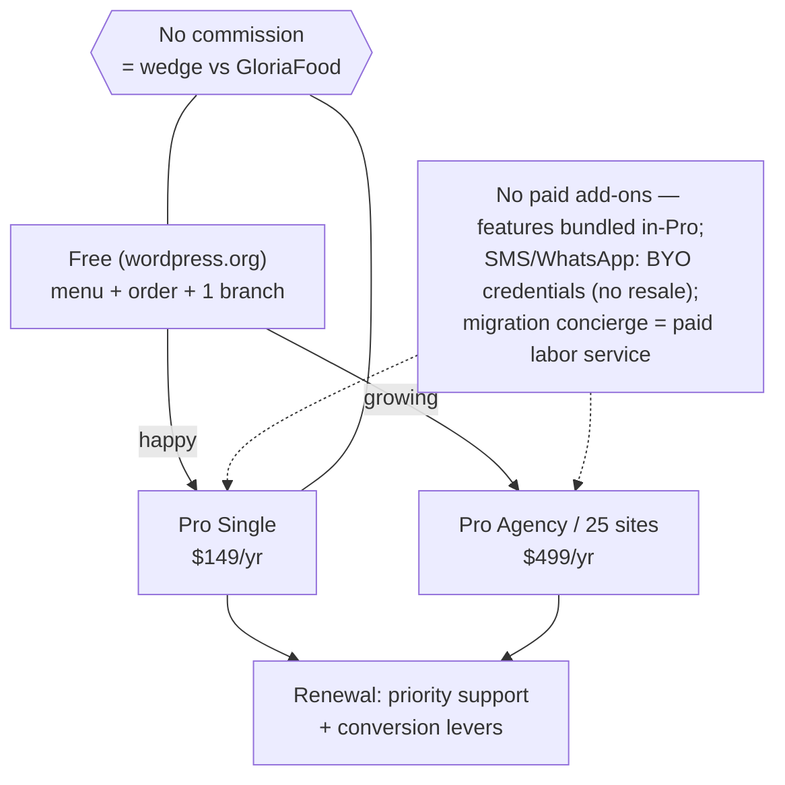
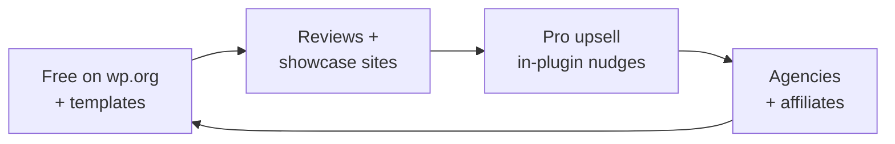

# 05 — Business Model & GTM

> [!abstract] Goal
> Decide how money flows before we scope Pro features. Packaging drives the free/pro split in [[06-technical-architecture]].

## Money flow

## Packaging draft (recommended in [[13-business-plan#5. Pricing tiers recommendation]], founder to sign)

| Tier | Price | Gets | Gate rationale |
|------|-------|------|----------------|
| Free | $0 | Menu, variations/add-ons, basic order, 1 location, reservation-lite, QR view, coupons **(M3)**, importer + **AI menu import (M3)**, delivery **(M3)** | distribution + reviews; more generous than Orderable free. **Free = take the order** |
| Pro Single | $149/yr / 1 site | QR table sessions, floor-lite, deposits+reminders, bumps/tipping, receipt builder, pause/resume, **capacity-lite slot caps, honest prep-time, basic sales + product reports** | price-match Orderable; win on speed + working QR. **Pro = run the rush** — this is the upgrade reason for takeaway/cloud-kitchen, the highest-WTP segment |
| Pro Plus | $249/yr / 3 sites | + full floor plan, SMS/WhatsApp notifications (BYO keys), adv. delivery, analytics suite | undercuts Five Star 5-site €247. **3 single-location sites until M5 — multi-location ships in V2b** |
| Pro Agency | $499/yr / 25 sites | + white-label + API/headless **(M5)**, best-effort priority support | agencies proved to pay (Five Star "most popular"). **25 single-location sites until M5** |
| Launch LTD (optional, capped) | $299 one-time | Single-site, **NO support included** (docs + forum only; paid support separate), cap 200 units | cash + reviews; sunset on schedule. **Lifetime support is unaffordable as a solo founder (locked 2026-09-06)** |

> [!warning] Launch honesty (locked 2026-09-06)
> Multi-location ships in **M5 (V2b)**, after launch. Plus/Agency therefore sell **site counts for single-location installs** at launch, and the pricing page must say multi-location is "coming in the first post-launch update" — never imply it ships on day one.

> [!success] Founder decisions (locked 2026-09-06)
> - [x] Approve $149 / $249 / $499 + capped $299 LTD (200 units) — APPROVED
> - [x] 14-day money-back? -> Yes (locked 2026-09-05)
> - [x] Paid add-ons? -> None — all features bundled in-Pro forever. SMS/WhatsApp = restaurant brings **own credentials** (Twilio/WhatsApp) and pays its own provider — no credit bundles, no resale, no margin (locked 2026-09-06). Migration concierge = optional **paid labor service $199**, not an add-on (locked 2026-09-06).
> - [x] Pro Plus channel gate: SMS/WhatsApp notifications enabled from Pro Plus tier (BYO keys)

## GTM flywheel

## Launch channels (checklist)

- [ ] wordpress.org listing (screenshots, demo URL, video)
- [ ] 3 pilot restaurants (logo + testimonial rights) — DEFERRED 2026-09-06: recruit from first real customers/users, no pre-named pilots
- [ ] Agency / freelancer outreach (smoothplugins.com network — founder ex-Arraytics contacts, no Arraytics affiliation)
- [ ] Content: "migrate from X in an afternoon" guides
- [ ] Lifetime / launch pricing window? : Target launch date is January 1, 2027.

## Unit economics (back-of-napkin)

| Input                  | Assumption (from [[13-business-plan]]) | Notes                   |
| ---------------------- | ----------------- | ----------------------- |
| Free installs → active | 25% menu-live; 12% first real order ≤14d | north-star activation |
| Active → Pro           | 1.5% Y1 → 2% Y2+                | benchmark 1–3%          |
| ARPU                   | $129 Y1 → $149 Y2 → $159 Y3 | blended tiers |
| Support min / ticket   | 15 min avg; 2% free file/yr | prices support load     |
| Churn                  | ≤25%/yr; renewal 70%→80% | reminders + KDS reduce? |
