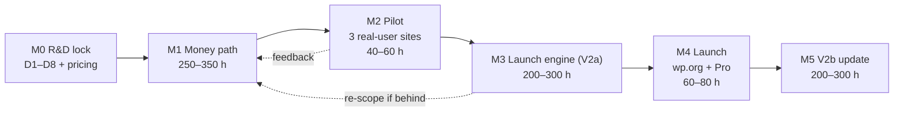

# 07 — Roadmap & Milestones

> [!abstract] Rule
> No milestone without an exit criterion — and no date without an hour budget. Each milestone ends with something demo-able to a restaurant owner.

> [!success] Re-planned 2026-09-06 — solo + AI-assisted, hour-budgeted
> Reality inputs (locked in [[13-business-plan]]): the founder is the **only engineer**, at **10–15 h/wk**, with 1–2 interns for misc work; **heavy AI-assisted development (CLI coding agents running milestone-sized tasks)** is the throughput multiplier that makes this viable; cash burn **<$100/mo** (Bangladesh).
> **Jan 1, 2027 is a symbolic target, not a commitment — quality-first.** Dates are derived from `hours ÷ actual hours per week` and **re-forecast at the end of every month**.

## Milestone chain

## Milestone table (hour-budgeted)

| # | Milestone | Ships | Hours | Exit criterion (demo-able) | Owner |
|---|-----------|-------|-------|----------------------------|-------|
| M0 | R&D lock ✅ | This vault + D1–D8 + pricing | done | Done 2026-09-06 | Founder |
| M1 | **Money path** (Wave 1 MVP, QR-first) | Menu blocks + variations/add-ons, cart + `Totals::calculate()`, **Stripe + PayPal + COD**, orders + append-only ledger, slots (ASAP/scheduled/lead/holidays), email queue, dashboard + print, reservations-lite, **QR table sessions (Pro feature)**, security + opt-in telemetry | **250–350 h** | On a live site with **zero Woo installed**: real Stripe test payment + real COD order + QR table order + booking — and the **money-path gate green** (refund drill, reconciliation report, webhook replay, double-click, offline-retry) | Founder + AI agents |
| M2 | Pilot | 3 live sites recruited from first real customers/users (no pre-named pilots, locked 2026-09-06) | **40–60 h** | **Willingness-to-pay recorded**: each pilot answers "would you pay $149 today?" — the only committed pilot metric (conversion % is unmeasurable at n=3) | Founder |
| M3 | **Launch engine** (V2a) | QR hardening, floor plan-lite, coupons, delivery zones + distance fees, pause/resume (Pro), bumps/tips, receipt builder, **capacity-lite slot caps + honest prep-time + basic sales/product reports** (the Pro "run the rush" value), **AI menu import (URL/PDF/photo → menu)** + competitor importer (+ CSV if cheap), deposits base, reminders (BYO SMS/WhatsApp), diagnostics | **200–300 h** | Money-path gate re-run green; Pro demo live on one site; AI import parses a real 40-item menu | Founder + AI agents |
| M4 | Launch | wp.org + Pro + docs + demo | **60–80 h** | 500 installs + first Pro sale in 30d (draft — from [[13-business-plan]] funnel) | Founder |
| M5 | **V2b** (first post-launch update) | KDS-lite, kitchen-load capacity throttle, multi-location, advanced analytics + margins/recipe costing, white-label + API extras | **200–300 h** | KDS live in 1 pilot kitchen | Founder + AI agents |

**M1→M4 ≈ 550–790 h.** At 10–15 h/wk (~600 h/yr) that is **11–15 calendar months** of pure build time; the AI-assisted multiplier is the bet that compresses it. It is **measured, not assumed** — see [[08-risks-open-questions]].

> [!warning] Throughput checkpoint (the plan's honesty mechanism)
> After the first **40 h of M1**, compare planned vs actual hours. If throughput is materially below plan, **re-scope M3 before re-dating the launch** — never the reverse.

## Pre-agreed cut order (if behind)

1. PayPal (Stripe + COD only) · 2. Diagnostics panel (keep the minimal health badge) · 3. Coupons · 4. Reservations-lite · 5. Delivery zones + distance fees.

> [!danger] Never cut
> `Totals::calculate()` golden fixtures · append-only ledger · webhook idempotency · QR table sessions · PHPUnit + Playwright money-path tests.

## Deferred out of Wave 1 (locked 2026-09-06)

- [x] **Competitor importer + CSV import → M3.** Pilots enter menus by hand; setup friction is observed informally, but the only committed pilot metric is willingness-to-pay.
- [x] **Delivery + zones/distance fees → M3.** Wave 1 ships **pickup + QR dine-in only**.
- [x] **AI menu import** (paste a menu URL / upload PDF or photo → structured menu) → M3. It is the onboarding weapon that replaces CSV + competitor importer for "menu live <1 day".

## What we deliberately defer (locked V1 — see [[14-ideal-product#7. What is deliberately NOT in the ideal product]])

- [x] Native POS hardware
- [x] Delivery-fleet tracking
- [x] SaaS-hosted version
- [x] Native support across multiple builders like elementor, bricks builder etc
- [x] **Multi-location → M5 (V2b).** `04` marked it *Must*; **downgraded to Could / V2b on 2026-09-06**. Launch stays honest: Pro Plus ($249/3 sites) and Agency ($499/25 sites) sell **single-location site counts** until M5, and multi-location is published as "coming in the first post-launch update".
