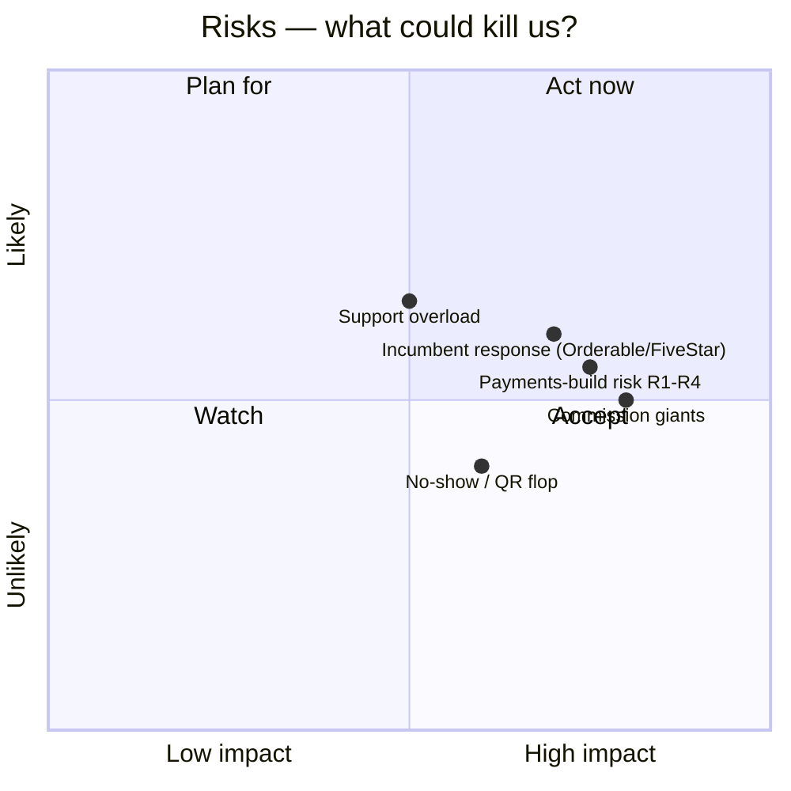

# 08 — Risks & Open Questions

> [!abstract] Living note
> Keep this open through the whole R&D. Every fear goes here with likelihood × impact and an owner + date.

## Risk radar

## Risk register (scored 2026-09-05 — draft for founder sign-off)

| Risk                               | L × I  | Mitigation                                                                                                         | Owner  | Date |
| ---------------------------------- | ------ | ------------------------------------------------------------------------------------------------------------------ | ------ | ---- |
| WPCafe as external rival (no affiliation) | 2×4=8 | Treat as competitor: switch campaign + importer + "migrate in an afternoon" guide; no shared roadmap (locked 2026-09-06 — Smooth is smoothplugins.com independent) | Founder | 2026-09-19 |
| Woo-optional doubles checkout work | — | **RESOLVED: standalone locked** ([[15-standalone-strategy]]) — risk retired, replaced by payments-build risk R1–R4 | Founder | — |
| Restaurants won't scan QR          | 2×3=6 | Pilot-measure; keep waiter-flow fallback                                                                           | Founder | pilot |
| No-shows persist despite reminders | 3×3=9 | Deposits + reminders in M3; measure in pilots                                                                      | Founder | M3 |
| **Founder-hour throughput** (10–15 h/wk vs ~550–790 h to launch) | **4×5=20** | **Highest risk in the plan.** Hour-budgeted milestones + **40 h checkpoint** in M1 + pre-agreed cut order; **re-scope before re-dating** ([[07-roadmap-milestones]]) | Founder | M1 wk1 |
| **AI-generated code correctness** (money path) | 4×5=20 | Tests are the contract: golden fixtures, replay/double-click/offline-retry E2E, money-PR checklist; **tests are on the never-cut list** ([[16-technical-details#13.8 AI-assisted development model]]) | Founder | always |
| **Solo key-person risk** (bus factor 1) | 3×5=15 | Everything in repo + this vault (docs-as-code, no tribal knowledge); AI agents + interns can continue from notes; no unreleased knowledge in the founder's head | Founder | always |
| Launch date slippage (Jan 1 symbolic) | 4×3=12 | Date is explicitly **not** a commitment; publish only when the money-path gate + pilots are green | Founder | M4 |
| Takeaway sees no reason to upgrade | 3×4=12 | Pro = "run the rush" (capacity-lite, honest prep-time, reports, pause/resume, bumps) — locked 2026-09-06 as the upgrade reason for the highest-WTP segment | Founder | M3 |
| Multi-location missing at launch (tier credibility) | 3×3=9 | Sell site counts honestly; publish multi-location as "first post-launch update"; consider delaying Pro Agency if pushback | Founder | M4 |
| LTD support debt | 2×4=8 | **LTD includes no support** (docs + forum only) — locked 2026-09-06; cap 200 units | Founder | launch |
| Support drowns a solo founder      | 3×4=12 | AI drafts replies (founder approves) + intern triage + onboarding wizard + diagnostics; **relaxed SLAs** (Free best-effort 72–96h, Pro 48h) | Founder | launch |
| Founder burnout / health           | 3×4=12 | 10–15 h/wk is intentionally sustainable; if hours must rise to hold a date, **cut scope instead** | Founder | always |

## Open questions (founder queue)

- [x] #1 WPCafe relationship? → **LOCKED 2026-09-06: external competitor, no affiliation** (smoothplugins.com independent; founder ex-Arraytics) → [[01-vision-problem]]
- [x] #2 Woo required / optional / native? → **LOCKED standalone-native**, see [[15-standalone-strategy]]
- [x] #3 QR-first or reservation-first MVP? → **LOCKED 2026-09-06: QR-first** — QR table sessions in MVP, deposits/reminders → V2 → [[04-feature-map]]
- [x] #4 Single Pro vs tiers vs lifetime? → **LOCKED 2026-09-06: tiers $149 / $249 / $499 + $299 LTD (cap 200), 14-day refund** → [[05-business-model-gtm]]
- [x] #5 First 3 pilot restaurants — DEFERRED 2026-09-06: recruit from first real customers/users → [[07-roadmap-milestones]]
- [ ] #6 Migration messaging (competitor → Smooth incl. WPCafe) — switch copy + importer scope (external switch, not own upgrade)
- [ ] #7 **AI menu import (M3)** — which input sources (menu URL / PDF / photo), accuracy bar before we ship it, cost per parse, and who fixes a bad parse
- [ ] #8 **Throughput reality check** — after the first 40 h of M1: actual vs planned hours; if behind, what leaves M3 ([[07-roadmap-milestones]])
- [ ] #9 **Takeaway upgrade proof** — pilots must answer "would you pay $149 for run-the-rush features?"; if no, the Pro gates need re-cutting before launch

## ChatGPT import — ✅ imported 2026-09-05

Full content triaged into [[04-feature-map#Imported roadmap]], [[09-whitespace-gaps]], [[10-marketing-plan]], and [[02-market-competitors#Install base]]. Original share link was JS-gated; pasted text is the source of truth.
