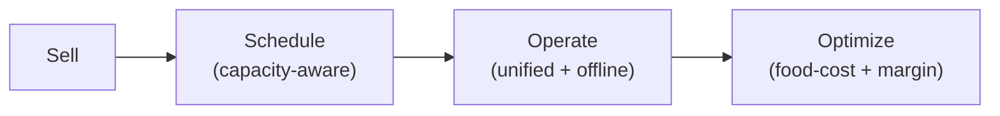

# 09 — Genuinely Underserved Gaps (post-correction)

> [!abstract] Correction applied (ChatGPT re-check)
> QR ordering, KDS, loyalty, POS, waitlists, AI menu import, multi-location, delivery zones, reservations are **no longer whitespace** — WPCafe, RestroFood, DineKit, Libre Bite already cover them. Do NOT position on those. Bet below instead.

## Gap table

| Gap | Top-plugin coverage | Importance | Free / Pro |
|-----|--------------------|------------|------------|
| Unified operating timeline (booking → seating → order → kitchen → served → paid) | essentially absent | ⭐⭐⭐⭐⭐ | Pro |
| Cross-channel unified order queue (web + QR + POS + phone/manual) | rare / fragmented | ⭐⭐⭐⭐⭐ | Pro |
| Capacity-aware ordering (kitchen load throttles slots) | very weak | ⭐⭐⭐⭐⭐ | Pro |
| Capacity-aware reservations (tables + kitchen together) | rare | ⭐⭐⭐⭐⭐ | Pro |
| Intelligent prep-time from live kitchen load | essentially absent | ⭐⭐⭐⭐⭐ | Pro |
| 86 / ingredient availability → auto-sold-out | very limited | ⭐⭐⭐⭐⭐ | Free basic / Pro advanced |
| Recipe + ingredient inventory tied to menu | essentially absent | ⭐⭐⭐⭐⭐ | Pro |
| Food-cost / margin per dish | essentially absent | ⭐⭐⭐⭐⭐ | Pro |
| Auto menu engineering (stars/plows/dogs) | essentially absent | ⭐⭐⭐⭐ | Pro |
| Waste tracking | essentially absent | ⭐⭐⭐⭐ | Pro |
| Staff tasks tied to orders | very weak | ⭐⭐⭐⭐ | Pro |
| Behavior CRM (frequency, AOV, favorites) | limited | ⭐⭐⭐⭐ | Pro |
| No-show risk scoring + auto-deposit | essentially absent | ⭐⭐⭐⭐ | Pro |
| Offline-first POS/KDS/table ordering + auto-recovery | rare (Libre Bite online-only) | ⭐⭐⭐⭐⭐ | Pro |
| One-click competitor migration | essentially absent | ⭐⭐⭐⭐ | Free |
| Restaurant perf diagnostics | essentially absent | ⭐⭐⭐⭐ | Free/Pro |
| Zero-dependency lightweight frontend | rare | ⭐⭐⭐⭐⭐ | Free |
| API-first platform for agencies | weak | ⭐⭐⭐⭐ | Pro |

## The 5 bets

1. **Capacity-aware ordering** — "kitchen full, next pickup 8:05 PM", not "7:30 PM".
2. **Ingredient → availability → ordering** — stock hits zero → item auto-86'd.
3. **Unified service timeline** — one flow, not three modules.
4. **Offline-first ops** — Wi-Fi dies, service continues (YeePOS proves viable).
5. **Profitability intelligence** — "which dishes make money?", not "what did I sell?"

## Positioning

> **"The restaurant operating system for WordPress — not just an ordering plugin."**
> Pillars: **Sell → Schedule → Operate → Optimize** (Schedule = capacity-aware ordering + reservations; aligns with [[13-business-plan]] and [[14-ideal-product]]).
