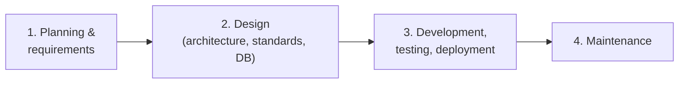

# 11 — SRS & Build Process (from whiteboard, 2026-09-05)

> [!abstract] Principles
> Decisions are made against data. Claims are made against data.

## SDLC phases

## 1. Requirement analysis (per feature)

- Existing core competitor features
- Wanted-but-missing features (forum, roadmap, GitHub issues)
- Pricing and marketing strategy
- Largest lacking + standard features
- Per feature: **a) feasibility, b) ROI, c) free/premium**

## 2. Writing an SRS (per feature)

- Feature: user journey, which problem it solves (`ki problem solve kortesi`)
- Technical: API, hooks & filters, diagram
- Timeline: man-hours
- Example usage
- Alternative considered + why rejected
- NFRs: performance, extensibility / modifiability

## 2b. Design gate

Code architecture, code standards, database design — decided before development, not during.

## Strategy lens (left column of board)

1. Improve something existing (`existing kisu improve korte`)
2. Specialize vs existing solutions
3. Solve a completely new problem
4. Scale an existing solution
5. New solution to an existing problem

> Smooth = primarily **#1 + #2 + #5**: better-in-every-sense independent rival, specialized on performance + agency-friendliness.
