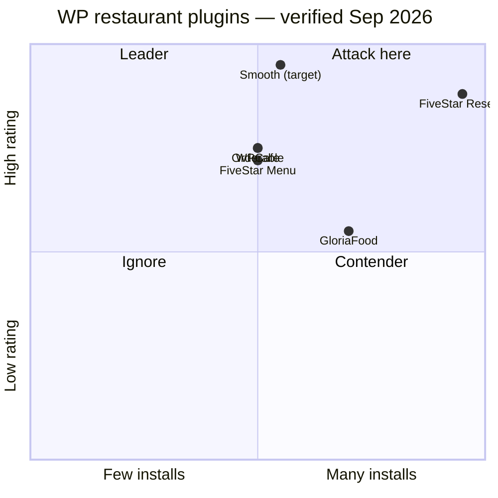
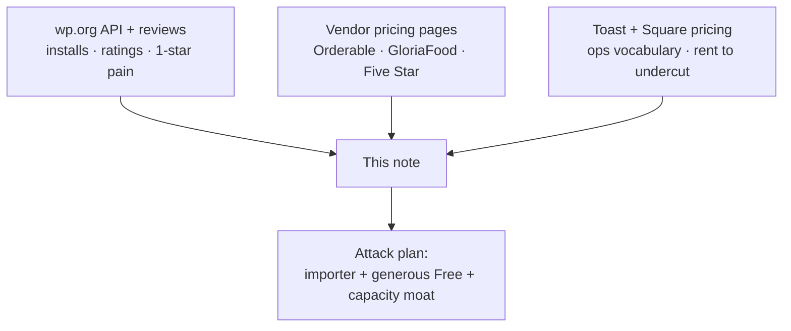

# 12 — Competitor Deep Dive (verified 2026-09-05)

> [!abstract] Sources
> wordpress.org API (installs, ratings, versions), wp.org reviews/support forums, vendor pricing pages (Orderable, GloriaFood, Square, Toast, Five Star, WPCafe).
> Profit/revenue data is private for all — install bands + pricing gates are the proxy. Do not present bands as market share.

## Scoreboard (live API data)

| # | Product | Space | Installs | Rating (n) | 1★ share | Last update | Signal |
|---|---------|-------|----------|------------|----------|-------------|--------|
| 1 | GloriaFood (`menu-ordering-reservations`, Oracle) | WP + SaaS | 7,000 | 88 (54) | 7% (4) | 2025-04-14 ⚠️ stale ~17 mo | biggest free suite, going stale |
| 2 | Orderable (Liquid Web/Nexcess) | WP | 5,000 | 92 (40) | 8% (3) | 2026-05-08 | polished ordering, Pro $149/yr |
| 3 | WPCafe (Arraytics, external — founder ex-team, no affiliation) | WP | 5,000 | 92 (109) | 8% (9) | 2026-08-31 | broadest suite, bug/perf complaints |
| 4 | Five Star Reservations (Rustaurius) | WP | 10,000 | 94 (211) | 5% (10) | 2026-08-20 | reservations king, upsell anger |
| 5 | Five Star Menu (Rustaurius) | WP | 5,000 | 92 (107) | 7% (8) | 2026-08-20 | menu+ordering, Stripe/PayPal in core |
| ref | Toast / Square | SaaS | — | — | — | — | ops depth WP can't touch; $$ + lock-in |

## 1. GloriaFood — free-suite giant, stale + hosted lock-in

- **Pricing (gloriafood.com/pricing):** core FREE (unlimited orders/locations, no commission): ordering widget, reservations, QR dine-in, drawn delivery zones, scheduled orders, out-of-stock flags, promos/coupons, reports, EOD email. Paid: POS $49/mo/location, online payments $29/mo, reservation deposits $0.50/guest, advanced promo $19/mo.
- **Praised:** free + simple, pandemic lifesaver, easy setup.
- **Pain (wp.org reviews):** demands legal-entity + TAX ID to use anything; "missing features / not flexible"; printer + mark-complete issues; no admin order dashboard; support MIA; **no update since Apr 2025**.
- **Gap to steal:** self-hosted data ownership, flexibility, maintained codebase, real order dashboard.

## 2. Orderable — the execution benchmark

- **Pricing (orderable.com/pricing):** Free: menu layouts, mobile ordering, date slots, ASAP, lead time, preorder days, holidays, live order view, receipt printing. **Pro $149/yr/1 site**, zero commission: time slots, max orders/day+slot (capacity!), QR table ordering, multi-location, add-ons, order bumps, custom checkout, tipping, timed products, custom statuses + SMS/WhatsApp/email notifications, receipt builder, pause/resume.
- **Praised:** support quality (dominant theme), complete ordering workflow.
- **Pain (support forum, live):** timeslot/scheduling bugs recurring; **Woo block-checkout incompatibility**; mobile-view issues; breaks on Woo updates; add-button/cart AJAX glitches; multi-location issues; one security (broken access control) thread; users begging for temporary-hours + live order view improvements.
- **Gap to steal:** scheduling that actually works, block-checkout-native, update-proof Woo integration, capacity-aware slots (theirs is a static cap).

## 3. WPCafe (external competitor) — broadest, heaviest

- **Pricing:** free on wp.org; Pro via themewinter.com (verify tiers): menu layout packs, one-page checkout, live notification + tipping, reservation styles, locations, Elementor widgets, multivendor.
- **Praised:** feature breadth, freelancer-friendly, fast support responses.
- **Pain (1★ reviews):** "too many bugs", fatal errors, **QR ordering does not work**, no translation / bad English, pro-purchase regret ("stay away", "waste of money"). Tech: ~820K JS + 475K CSS unconditional (see `WPCafe/WPCafe.md` — prior-work reference only).
- **Gap to steal:** literally the Smooth thesis — same breadth, working QR, i18n from day 1, 0 KB on non-Smooth pages.

## 4. Five Star Reservations — distribution king, upsell resentment

- **Pricing:** free base; Premium 1-site €167 (reg €247), 5-site €247 (**"most popular" = agency channel proven**), 10-site €397; Ultimate €297/yr (SMS, reminders, table select/assign, deposits, mobile app). 7-day trial, 14-day guarantee.
- **Praised (211 reviews, 94):** works flawlessly, support.
- **Pain (1★):** "Buy Premium! Unlock Premium!" fatigue; "no more work after premium"; email deliverability; flexibility.
- **Gap to steal:** reservations + deposits + reminders **generous in Free**, no nagware; fold ordering in (theirs is a separate plugin).

## 5. SaaS reference — Toast & Square (what WP can't do yet)

- **Toast (pos.toasttab.com/pricing):** quote-based, hardware-locked, offline mode, KDS, xtraCHEF food-cost analytics, payroll, loyalty, gift cards, multilocation, 24/7 support. Complaint pattern: cost creep, hardware lock-in, contract/processing lock-in.
- **Square Restaurants (verified pricing page):** Free $0/loc (2.6%+15¢ in-person, 3.3%+30¢ online) → Plus $49/mo/loc → Premium $149/mo/loc; KDS $30/$20 per device/mo; Kiosk $50/$30; MarketMan ingredient inventory $99/mo/loc; auto-86 from stock counts, coursing, split checks, QR ordering (paid tiers), offline payments (24h). Wedge vs them: **no hardware, no processing cut, you own the site/SEO/data**.
- **Takeaway for Smooth:** copy their ops vocabulary (86, coursing, fire times, KDS timers) without their rent extraction.

## Unified feature list — tier + effort (T-shirt; 1 team, rough)

| Feature | Tier | Effort | Why here |
|---------|------|--------|----------|
| Menu builder (cats, items, images, prices) | Free | M | parity; acquisition |
| Variations & add-ons | Free | M | parity; Orderable paywalls it — we weaponize it |
| Pickup + delivery ordering | Free | M | parity |
| Mobile-first checkout (block-native) | Free | L | Orderable's #1 complaint thread |
| Date slots + ASAP + lead time + holidays | Free | M | parity with Orderable free |
| Opening hours / availability | Free | S | parity |
| Reservations (3-tap) + email confirm | Free | M | attack Five Star with generosity |
| QR menu (view) | Free | S | parity with GloriaFood |
| Order dashboard + live view + printing | Free | M | GloriaFood lacks admin control |
| Coupons / basic discounts | Free | S | parity |
| Delivery zones (drawn) + distance fees | Free | M | GloriaFood/Orderable prove value |
| Out-of-stock / 86 flag (manual) | Free | S | ops credibility, cheap |
| Competitor importer (menu/cats/prices/add-ons) | Free | M | steal 1,000s of installed sites |
| Time slots + max orders per slot (capacity-lite → **M3**) | Pro | M | Orderable's cap, but capacity-aware = ours |
| QR table ordering + table sessions | Pro | L | WPCafe's broken promise — ship working |
| Visual floor plan | Pro | L | proven gap |
| Deposits + reminders (SMS/WhatsApp/email) | Pro | M | anti-no-show revenue (Five Star €-model) |
| Custom statuses + driver/customer notifications | Pro | M | parity with Orderable Pro |
| Order bumps / upsells + tipping | Pro | S–M | AOV lift, proven $149 bundle |
| Receipt builder (kitchen/delivery/packing) | Pro | M | ops depth |
| Pause/resume ordering (per service) | Pro | S | kitchen chaos valve, cheap + loved |
| Multi-location + branch menus/hours | Pro | L | ARPU + agency channel — **ships M5, not at launch** (tiers sell site counts until then) |
| Capacity-aware ordering (kitchen load throttles → **M5**) | Pro | XL | **unique — nobody has it**; capacity-*lite* caps ship M3 |
| Live prep-time from kitchen load (estimate → **M3**, load-based → **M5**) | Pro | L | **unique** |
| Ingredient → auto-86 + recipe costing + margin | Pro | XL | **unique; Square charges $99/mo via MarketMan** |
| Unified timeline (book→seat→order→paid) | Pro | XL | **unique** |
| Offline-first KDS/queue + auto-recovery | Pro | XL | **unique in WP; Toast has it at $$$** |
| Behavior CRM + no-show scoring + auto-deposit | Pro | L | **unique** |
| Perf: conditional assets, cached menu/config, budgets | All | M (ongoing) | the philosophy; WPCafe scar tissue |
| Agency kit: docs, hooks/API, headless, starter templates | Free docs / Pro API extras | M | whiteboard mandate; Five Star proves agencies pay |

## USP (post-research, final)

> **The restaurant operating system for WordPress — Sell → Schedule → Operate → Optimize.**
> Free gets you online (menu, ordering, reservations, QR). Pro runs you better (capacity, kitchen, floor, margins, multi-branch). No commission, no hardware, you own everything — at highest speed.

## Top pain themes (frequency across sources)

1. Bugs/fatals on update (WPCafe, Orderable×Woo) → update-proofing + diagnostics = feature.
2. Scheduling/timeslot unreliability (Orderable forum) → capacity-aware done right.
3. QR ordering broken/missing depth (WPCafe 1★) → working QR + table sessions.
4. Premium nagware + paywalled basics (Five Star) → generous free, no nags.
5. Hosted data + tax-ID + lock-in (GloriaFood, Toast, Square) → self-hosted ownership.
6. i18n/translation gaps (WPCafe) → WPML/Polylang + full strings from day 1.

## Source links (re-verify before launch)

- wp.org plugins: [GloriaFood](https://wordpress.org/plugins/menu-ordering-reservations/) · [Orderable](https://wordpress.org/plugins/orderable/) · [WPCafe](https://wordpress.org/plugins/wp-cafe/) · [Five Star Reservations](https://wordpress.org/plugins/restaurant-reservations/) · [Five Star Menu](https://wordpress.org/plugins/food-and-drink-menu/)
- wp.org reviews/support sampled: [WPCafe 1★](https://wordpress.org/support/plugin/wp-cafe/reviews/?filter=1) · [GloriaFood reviews](https://wordpress.org/support/plugin/menu-ordering-reservations/reviews/) · [Five Star 1★](https://wordpress.org/support/plugin/restaurant-reservations/reviews/?filter=1) · [Orderable forum](https://wordpress.org/support/plugin/orderable/)
- Pricing: [Orderable](https://orderable.com/pricing/) · [GloriaFood](https://www.gloriafood.com/pricing) · [Five Star Reservations](https://www.fivestarplugins.com/plugins/five-star-restaurant-reservations/) · [WPCafe Pro](https://themewinter.com/wp-cafe/pricing/) · [Square](https://squareup.com/us/en/point-of-sale/restaurants/pricing) · [Toast](https://pos.toasttab.com/pricing)
