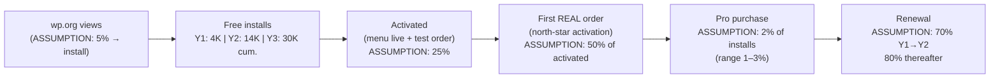
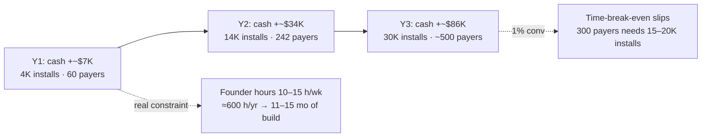

# 13 — Business Plan (the missing-numbers note)

> [!abstract] What this note is
> Everything in [[05-business-model-gtm]] left as TODO, quantified. Sizing, revenue math, costs, break-even, pricing, team, legal, support, KPIs, funding stance, moat, and competitive response — from a **pure business-plan perspective**.
> Every number below is either **sourced** (from [[02-market-competitors]] / [[12-competitor-deep-dive]]) or marked **ASSUMPTION**. Treat ASSUMPTIONs as hypotheses to validate in [[07-roadmap-milestones]] pilots.

> [!success] Locked architecture decision (2026-09-05)
> **Smooth Restaurant is STANDALONE — no WooCommerce dependency, built from scratch for performance.**
> Rationale: [[12-competitor-deep-dive]] shows Orderable's #1 complaint thread is Woo block-checkout incompatibility + breakage on Woo updates; [[01-vision-problem]] mandates 100 web-vitals + 50k users on 1 CPU/4GB. A native checkout + order engine removes the Woo tax (update fragility, heavy cart/session tables, shortcode soup) and is the performance moat. Consequences locked in: (a) we own checkout/payments via Stripe/PayPal SDKs, (b) we ship a [[04-feature-map]] competitor importer (Woo-food + Orderable + WPCafe) to steal installed sites, (c) optional Woo-bridge is V3 at earliest — never MVP. This supersedes the "Woo or lite?" open question in [[04-feature-map]] and decision D1 in `06-technical-architecture`.

## 1. TAM / SAM / SOM (bottom-up)

> [!warning] Method note
> wordpress.org gives **install bands, not revenue or market share**. All sizing below is bottom-up from bands + public restaurant counts. Label discipline enforced.

### 1a. Starting facts (sourced)

- WP competitor install bands (sourced, [[02-market-competitors]] + [[12-competitor-deep-dive]]): Five Star Reservations 10K+, GloriaFood 7K+, Orderable 5K+, WPCafe (Arraytics external, no affiliation) 5K+, Five Star Menu 5K+ → **~32K+ known WP restaurant-plugin installs** (bands are floors; true number higher).
- Price anchors (sourced): Orderable Pro **$149/yr**; Five Star Premium 1-site **€167** / 5-site **€247** / Ultimate **€297/yr**; GloriaFood POS **$49/mo/location**, online payments $29/mo; Square **$0 / $49 / $149 per location/mo** + processing 2.6%+15¢ in-person / 3.3%+30¢ online; Square KDS $20–30/device/mo, MarketMan inventory $99/mo/location.
- Positioning (locked): "restaurant operating system for WordPress" — [[09-whitespace-gaps]] pillars Sell → Schedule → Operate → Optimize.

### 1b. TAM (total addressable market)

- Global restaurants: **ASSUMPTION: ~15M food-service establishments worldwide** (industry estimates range 12–22M; pick 15M as working midpoint — validate before investor use).
- Share with a website: **ASSUMPTION: 60%** → 9M. Share of websites on WordPress: **ASSUMPTION: 40%** (W3Techs ~43% of web) → **TAM ≈ 3.6M WP-powered food businesses globally**.
- Sanity value: at $100/yr ARPU (**ASSUMPTION**, see §3), TAM ≈ **$360M/yr license revenue**, before payments/SMS add-ons. TAM is directional only — do not pitch it as plan.

### 1c. SAM (serviceable available market)

- SAM = English + WP.org-reachable + self-hosted-fit independents and small groups, ex-China/Russia app-superapp markets: **ASSUMPTION: 15% of TAM ≈ 540K sites**.
- Cross-check bottom-up from WP bands: known 32K installs are **ASSUMPTION: ~6% penetration of SAM** (32K/540K) — plausible for a fragmented 5-player field with stale leader (GloriaFood no update since Apr 2025, [[12-competitor-deep-dive]]). If penetration is actually 10%, SAM ≈ 320K — still same order of magnitude.

### 1d. SOM (serviceable obtainable market, 3 years)

- **ASSUMPTION:** Smooth reaches **30K free active installs by end of Year 3** (~today's combined mid-tier: credible if importer + wp.org SEO in [[10-marketing-plan]] work).
- At 1–3% free→paid conversion (**ASSUMPTION**, WP benchmark cited in [[05-business-model-gtm]]), that is **300–900 paying sites**; base case below uses **2% → 600 payers**.
- SOM revenue: 600 × ~$149 ARPU ≈ **~$90K/yr license run-rate at Y3 base case** (upside §3 to ~$200K+ with tier mix + add-ons). SOM is a foothold, not a ceiling — expansion comes from multi-location ARPU and agency seats (§5).

## 2. Revenue model math

### Funnel (the only funnel that matters — [[10-marketing-plan]] north metric)

- Worked example at 10K installs (Y2 run-rate): 10,000 × 2% = **200 payers**; × $149 blended ARPU (**ASSUMPTION**) = **~$29.8K new ARR per 10K-install cohort**, plus renewals.
- Conversion sensitivity (per 10K installs, $149 ARPU): 1% → $14.9K · 2% → $29.8K · 3% → $44.7K. **Every +0.5pt conversion ≈ +$7.5K per 10K installs (ASSUMPTION math).**

### 3-year revenue sketch (base / upside / downside)

> All inputs ASSUMPTION except anchors noted. Renewal 70%→80% ASSUMPTION. ARPU blends tiers in §5.

| Year | Cum. free installs | New payers (conv.) | Blended ARPU | New license rev | Renewal rev | Total license rev |
|------|-------------------|--------------------|--------------|-----------------|-------------|-------------------|
| Y1 | 4K (**ASSUMPTION**) | 60 (1.5%) | $129 | $7.7K | $0 | **~$8K** |
| Y2 | 14K (+10K) | 200 (2%) + 42 renew (70%) | $149 | $29.8K | $6.2K | **~$36K** |
| Y3 base | 30K (+16K) | 320 (2%) + ~170 renew (70–80%) | $159 | $50.9K | $38K | **~$89K** |
| Y3 upside (3% conv, $189 ARPU w/ add-ons) | 30K | 480 + renew | $189 | $90.7K | $55K | **~$146K** |
| Y3 downside (1% conv, churn 50%) | 30K | 160 + ~80 renew | $129 | $20.6K | $12K | **~$33K** |

- SMS/WhatsApp revenue: **none (locked 2026-09-06)** — restaurant uses own credentials and pays own provider; 0% resale/margin for us. WhatsApp/SMS notification *feature* is Pro+ per [[04-feature-map]], but the channel costs nothing to us at any volume.
- Migration-concierge revenue (Y1–Y2): **ASSUMPTION: 20 white-glove migrations × $199 ≈ $4K one-off** — optional paid labor service (locked 2026-09-06), lead-gen, not a line of business.

## 3. Cost structure

### Team — SOLO + AI (locked 2026-09-06)

> [!success] Reality, not aspiration
> Smooth is a **solo-founder company**: the founder is product, engineer, support and GTM. No 2nd engineer, no designer, no support hire — **1–2 interns** for misc work only (QA passes, docs drafts, demo sites, content). The capacity multiplier is **AI agents** (see [[16-technical-details#13.8 AI-assisted development model]]).

| Role | When | Cost (locked 2026-09-06) |
|------|------|--------------------------|
| Founder (build + product + GTM + support) | always, **10–15 h/wk** | $0 cash (sweat) |
| 1–2 interns (misc: QA, docs drafts, demo sites, content) | Pilot→ | ~$0–100/mo total (BD) |
| AI tooling (CLI coding agents + ops automation) | always | ~$20–100/mo |
| **Cash burn run-rate** | **M1→launch** | **<$100/mo (~$1.2K/yr)** |
| Y2–Y3 (interns + tools + optional contract design/QA) | scale | **~$150–400/mo (~$2–5K/yr)** |

> [!warning] The old plan assumed a team
> The previous version budgeted 1 FT engineer + 2nd engineer + 0.5 designer + 0.5 support ≈ $36–48K/yr. **Retired 2026-09-06.** Consequence: **cash break-even is now trivial; the binding constraint is founder hours, not money** (§4).

### Capacity model — the load-bearing assumption

- **Founder hours:** 10–15 h/wk (~50 h/mo, ~600 h/yr). This, not cash, sets the timeline — which is why [[07-roadmap-milestones]] is now **hour-budgeted** instead of date-budgeted.
- **AI multiplier (ASSUMPTION, must be measured):** CLI coding agents running milestone-sized tasks (founder reviews at PR level) are assumed to raise throughput substantially versus hand-written work. **First checkpoint: after the first 40 h of M1.** If measured throughput is materially below plan, re-scope M3 — do not re-date the launch first.
- **AI for operations (locked 2026-09-06):** support triage + draft replies, docs generation from DocBlocks, marketing/SEO content, and QA/code review. This is how one person covers support, docs and distribution at 10–15 h/wk.

### Support load (prices the freemium tax)

- **ASSUMPTION:** 2% of free actives file a ticket/yr; 15 min avg handle; Pro tickets 3× rate but priority SLA.
- At 10K actives: ~200 free tickets + ~120 Pro tickets/yr ≈ **~80 hrs/yr (~0.05 FTE)** — absorbable solo. At 30K: **~0.15 FTE** → covered by **AI-drafted replies + intern triage**, not a hire (see §6).
- Lever: onboarding wizard + AI menu import + diagnostics (Pro) per [[08-risks-open-questions]] cut tickets **ASSUMPTION: 30%**; **AI drafts first responses** (founder approves), which is the difference between 80 h/yr being absorbable or fatal at 10–15 h/wk.

### Infra + payment-adjacent costs (standalone consequences)

| Item | Cost | Note |
|------|------|------|
| Standalone checkout (native Stripe/PayPal SDKs) | dev cost only, **0% platform fee to us** | PCI via hosted fields/redirect — **never touch raw PAN** (§6) |
| Demo hosting + update infra + telemetry | **ASSUMPTION: $100–250/mo** | scales with demos, not tenants (self-hosted plugin) |
| Stripe fees | **borne by restaurant** (2.9%+30¢ typical, **ASSUMPTION**) | we take no cut — wedge vs GloriaFood/Square |
| SMS/WhatsApp (Twilio, restaurant-owned) | $0 for us — restaurant pays its own provider from own keys | Pro+ channel; abuse caps required; no margin, no billing infra |
| Email deliverability (SES/Postmark) | **ASSUMPTION: $20–80/mo** | Five Star's 1★ deliverability pain is our lesson ([[12-competitor-deep-dive]]) |
| i18n/L10n (WPML/Poly + translators) | **ASSUMPTION: $2–4K one-off + $1K/yr** | day-1 requirement (competitor 1★ lesson) |

## 4. Break-even sketch

### Recomputed for solo (locked 2026-09-06)

- Burn is now **~$1.2K/yr**, so **cash break-even ≈ 10–15 paying sites (~$1.5–2.2K revenue)** — effectively immediate and *not* the real constraint.
- The break-even that matters is **founder-time break-even**: revenue that justifies 10–15 h/wk of work. **ASSUMPTION: ~300–400 active payers (~$45–60K/yr ARR)** replaces the old "$80K/yr team" line.
- At 2% conversion, 300–400 payers needs **~15–20K free installs** — still inside the Y3 30K target, so the load-bearing number is unchanged; the *cash* risk has essentially disappeared.
- Downside: runway is **personal savings** (§9), so the binding risk is **months of build time**, not dollars.

| Year | Revenue (§2) | Cost (solo) | Cash result |
|------|--------------|-------------|-------------|
| Y1 | ~$8K | ~$1.2K | **+~$7K** |
| Y2 | ~$36K | ~$2K | **+~$34K** |
| Y3 base | ~$89K | ~$3K | **+~$86K** |

> [!question] The sensitivity that actually matters
> With burn <$100/mo, the old cash question is dead. The live question is **payer count vs founder hours**: at 1% conversion instead of 2%, reaching 300–400 payers takes roughly twice as long, and everything is gated by build throughput. **Willingness-to-pay (M2, [[07-roadmap-milestones]]) is the highest-value measurement in this plan** — at n=3 it is a directional signal, not a rate.

## 5. Pricing tiers recommendation (with anchoring)

Anchors (sourced): Orderable Pro $149/1-site · Five Star 1-site €167, 5-site €247 ("most popular"), Ultimate €297 · GloriaFood POS $49/mo · Square $49–149/mo/location.

| Tier | Price (recommend) | Gets (maps to [[12-competitor-deep-dive]] tier list) | Anchor logic |
|------|-------------------|------------------------------------------------------|--------------|
| **Free** | $0 | Menu builder, variations/add-ons (!), pickup + delivery, block checkout, slots/ASAP, reservations-lite + email, QR menu view, order dashboard + basic sales/order list, coupons **(M3)**, drawn delivery zones **(M3)**, manual 86, **AI menu import (M3)**, competitor importer **(M3)** | More generous than Orderable free (we weaponize paywalled variations) + GloriaFood parity; buys reviews + installs. **Free = take the order** |
| **Pro Single** | **$149/yr / 1 site** | Everything in Free + QR table sessions, floor plan-lite, deposits + reminders (email), custom statuses + notifications, bumps/tipping, receipt builder, pause/resume, **capacity-lite slot caps, honest prep-time estimate, basic sales + product reports** | **Price-match Orderable** — removes price from the decision; win on standalone speed + working QR. **Pro = run the rush** (this is the upgrade reason for takeaway/cloud-kitchen, the highest-WTP segment) |
| **Pro Plus** | **$249/yr / 3 sites** | Single × 3 + floor plan full, SMS/WhatsApp notifications (BYO credentials — no resale), advanced delivery rules, analytics suite | Undercuts Five Star 5-site €247 while adding ops depth; targets 2–10 location groups ([[03-personas-jtbd]]) |
| **Pro Agency** | **$499/yr / 25 sites** (+ white-label + API/headless **in M5**) | All + multisite, staging/dev, **best-effort priority support**; white-label + API extras ship in **M5 (V2b)** | Five Star proves agencies pay ("most popular" = 5-site); 1 agency ≈ 10–25 installs ([[10-marketing-plan]] step 7). **At launch this is 25 single-location sites** — multi-location ships in M5 |
| Launch LTD (optional, 14-day window) | $299 one-time / 1 site, no renewal, **NO support included** (docs + wp.org forum only; paid support separate) | Cash + launch reviews; cap at **ASSUMPTION: 200 units** (~$60K gross) | Support debt removed — a lifetime support promise is unaffordable as a solo founder (locked 2026-09-06) |

- No-commission pledge (all tiers) = wedge vs GloriaFood/Square cut; say it on pricing page verbatim.
- Money-back: 14-day, no questions (matches Five Star guarantee; lowers standalone-checkout trust hurdle).
- **No paid plugin add-ons (locked 2026-09-06)** — all feature tiers bundled in-Pro. SMS/WhatsApp: restaurant **brings its own Twilio/WhatsApp credentials** and pays its own provider (no credit bundles, no margin for us — we keep 0% of message revenue). Migration concierge: optional **white-glove labor service $199** (not an add-on; lead-gen). KDS/offline + recipe/food-cost stay **in-Pro** (moat, §10) — never separate plugins.

## 6. Team / hiring roadmap

| Phase (→ [[07-roadmap-milestones]]) | Team | Trigger |
|------|------|---------|
| M0 → M1 money path | Founder only (10–15 h/wk) + AI agents | — |
| M2 Pilot (3 real-user sites) | **+ 1 intern** (QA, docs drafts, demo sites) | first real user site live |
| M3 Launch engine | Founder + 1–2 interns + AI agents | pilot WTP signal (≥2 of 3 say "yes, $149") |
| M4 Launch | Founder + intern on support triage (AI drafts replies) | 500 installs |
| M5 V2b + scale | **Consider a contract dev only if revenue already covers it** | **≥300 payers (~$45K ARR)** |
| Never before PMF | No full-time hires, no sales team, no POS-hardware team, no SaaS-ops team | non-goals in [[01-vision-problem]] |

> [!warning] Retired 2026-09-06
> The old triggers (">2K installs → 2nd eng", "backlog >48h → support hire") are void: there is no 2nd engineer and no support hire. Capacity questions are now answered by **AI agents + interns**, and the only hiring gate is **≥300 payers**.

## 7. Legal / compliance checklist

- [ ] **Payments / PCI:** Stripe Elements / Payment Element + PayPal JS SDK only; **SAQ-A posture — no card data touches our servers**; confirm with Stripe docs at build. COD/wallet copy must disclose restaurant-held risk.
- [ ] **Licensing:** GPL-compatible for wp.org (Free); Pro via **EDD + Stripe (locked 2026-09-06)**; no encrypted/obfuscated Pro code that violates GPL expectations of agencies.
- [ ] **Privacy/GDPR:** DPA for any telemetry; cookie/order-data retention settings; data-export + erasure (diners + restaurants); sub-processor list (Stripe, PayPal, email vendor); SMS/WhatsApp sent via **restaurant-owned credentials** → restaurant remains controller, Smooth is processor (document in ToS + setup); EU demo region if storing PII.
- [ ] **Taxes:** VAT/GST on plugin sales self-handled via **EDD + Stripe (locked 2026-09-06)**; restaurant food-tax display is config, not advice.
- [ ] **Food/ops liability:** ToS disclaims allergen, 86-accuracy, prep-time-estimate reliance; KDS/offline docs state 24-h recovery limits (cf. Square offline 24h).
- [ ] **Trademarks/content:** "Smooth Restaurant" clearance search; demo food images licensed; importer must not copy competitor code — menu *data* only.
- [ ] **Consumer/regulatory:** no-show deposit + card-hold copy reviewed (PSD2/SCA in EU, card-network rules); SMS/WhatsApp opt-in + sender registration (10DLC/BSP).

## 8. Support ops plan

- Tiers (**relaxed 2026-09-06 for solo reality**): Free → wp.org forum, **best-effort 72–96h**; Pro → ticket desk, **48h weekday**; Agency → **best-effort priority** (no 12h/Slack commitment until real support capacity exists). Under-promise, over-deliver — a missed SLA is how a 5% 1★ rate is born.
- Self-serve first: onboarding wizard (<1 day to menu live), importer with dry-run report, perf diagnostics page (free — doubles as 1★-defense evidence), docs + hooks/API reference (agency mandate, [[01-vision-problem]]).
- Triage tags: `checkout-money` (P0) > `ordering-down` (P0) > `reservation` (P1) > `how-to` (P2); money-path bugs get hotfix lane.
- Staffing math: §3 — ~0.15 FTE at 30K installs, covered by **AI-drafted replies + intern triage** (founder approves), not a hire. Escalation trigger: backlog >96h for 2 consecutive weeks → intern hours increase, then consider contract support funded by revenue.
- Anti-nagware rule (from Five Star 1★s): zero upsell interstitials in order path; Pro nudges only on Pro-feature doors + one ROI line ("37 orders today — auto-control capacity?").

## 9. KPI dashboard

| Layer | Metric | Target (**ASSUMPTION** unless noted) | Source |
|-------|--------|--------------------------------------|--------|
| Acquisition | wp.org installs/wk; listing CVR | 150–300/wk by Y2; CVR ≥5% | wp.org stats |
| **Pilot (M2)** | **willingness-to-pay: "would you pay $149 today?"** | **≥2 of 3 pilots yes** (directional, n=3 — not a rate) | founder interviews |
| **Activation (north star)** | **install → first REAL order ≤14d** | **≥12%** | telemetry + [[10-marketing-plan]] |
| Setup | menu live ≤1 day; importer success | ≥40% menus live in 24h; importer ≥80% dry-run pass | telemetry |
| Conversion | free → Pro | 1.5% Y1 → 2% Y2+ (benchmark 1–3%, [[05-business-model-gtm]]) | store |
| Money | ARPU; NDR (expansion via Plus→Agency) | $129→$159; NDR ≥100% | store |
| Retention | logo churn; renewal rate | churn ≤25%/yr; renewal 70%→80% | store |
| Product | checkout <60s; menu p95 <2s; QR scan→paid | per [[01-vision-problem]] vitals 100 | RUM |
| Support | tickets/1K installs; TTFR; 1★ rate | <25/1K; <24h Pro; 1★ <6% (vs 5–8% incumbents, sourced §1a) | desk + wp.org |
| Love | NPS; reviews/mo; agency share of installs | NPS ≥50; ≥8 reviews/mo; agencies ≥20% | survey/store |

## 10. Funding / bootstrapping stance (recommendation)

- **Recommendation: bootstrap on personal savings (no outside capital, by default ever).** Reasons: (a) burn is **<$100/mo (~$1.2K/yr)** — the company is founder-fundable indefinitely; (b) WP-plugin outcomes ($30–150K ARR Y3) don't clear VC thresholds — raising now misprices the company; (c) wp.org distribution is earned, not bought. **LOCKED 2026-09-06** (corrected: previous version said "bootstrap via smoothplugins.com"; the actual source is **personal savings**).
- Revisit outside capital **only if** Y2 hits ≥10K installs + ≥2% conversion + NPS ≥50 **and** the binding constraint is provably cash rather than founder hours — then a small angel round to fund a contract team for the XL moat bets (KDS/offline, food-cost), [[09-whitespace-gaps]].
- LTD cap (200 × $299 ≈ $60K gross, **ASSUMPTION**) is the optional non-dilutive bridge — **no support included**, sunset on schedule regardless.

## 11. Moat / defensibility

1. **Standalone performance build** (locked): 0 KB on non-Smooth pages, conditional assets, cached menus — WPCafe scar tissue ([[04-feature-map]]) turned into architecture. Hard to retrofit into Woo-coupled rivals.
2. **Capacity-aware ops** (unique per [[09-whitespace-gaps]] bets 1–2): kitchen-load throttling + live prep-time + ingredient→auto-86. Orderable has static caps; Square charges $99/mo via MarketMan — ours is native + Pro-gated.
3. **Unified timeline + offline-first** (bets 3–4): book→seat→order→paid in one queue with auto-recovery. Toast-grade ops at WP price, no hardware.
4. **Distribution moat:** wp.org reviews + importer (steal 32K installed base) + agency program (Five Star proved the channel). Each agency embeds us in dozens of sites.
5. **Data gravity (later):** food-cost/margin + behavior CRM get smarter per restaurant — switching cost without lock-in rhetoric.

## 12. Competitive-response expectations

| Rival | Likely move (12–18 mo) | Our pre-empt |
|-------|------------------------|--------------|
| Orderable ($149 anchor) | Match QR/capacity polish; fix Woo-checkout threads | Ship block-native + scheduling-that-works first; "migrate in an afternoon" guide + importer |
| Five Star (reservations king, 10K) | Bundle ordering deeper; agency-tier push | Generous free reservations + deposits in Pro; Agency $499 undercuts 5-site €247 |
| GloriaFood (stale 17 mo) | Reboot or sunset WP bridge; push POS $49/mo | Attack staleness in comparisons; ownership + maintained-codebase narrative |
| WPCafe (external) | Ship "migrate in an afternoon" + importer | Generous free reservations + switch discount; Agency $499 undercuts 5-site €247 |
| Square/Toast | Ignore WP downmarket; raise SMB prices | ROI pages: "Toast ops vocabulary, zero hardware rent" — [[12-competitor-deep-dive]] §5 |
| RestroFood / DineKit / Libre Bite | Ship offline/CRM fast (gap closing) | Speed to capacity-aware + auto-86 (XL bets); perf budgets as review-bait |

## Founder inputs — locked 2026-09-06 (updated: solo + AI reality)

- [x] Confirm TAM/SAM assumptions — keep 15M / 60% / 40% as working ASSUMPTIONs (directional only)
- [x] Approve pricing: $149 / $249 / $499 + capped $299 LTD (200 units) — APPROVED
- [x] Capacity triggers **replaced 2026-09-06**: **≥300 payers (~$45K ARR)** is the only gate for paid help; interns can join from M2. The old triggers (>2K installs → 2nd eng; backlog >48h → support hire) are void
- [x] Pilot restaurants — DEFERRED 2026-09-06: recruit from first real customers/users, no pre-named pilots
- [x] WPCafe fate — LOCKED: external competitor, no affiliation; switch campaign + importer (no own-upgrade path)
- [x] Payments vendor-of-record — LOCKED: EDD + Stripe (self-run, founder handles VAT/GST)
- [x] Activation target 12% install→real-order ≤14d + telemetry consent copy (GDPR) — APPROVED
- [x] Bootstrap stance (no raise by default; personal savings fund it) + LTD cap 200 units — APPROVED
- [x] Support SLAs **relaxed for solo** (Free best-effort 72–96h / Pro 48h weekday / Agency best-effort priority) + no-nagware rule — APPROVED
- [x] STANDALONE lock (no Woo dependency) — LOCKED
- [x] **Solo + AI operating model (locked 2026-09-06):** founder is the only engineer at **10–15 h/wk**; 1–2 interns for misc only; **CLI coding agents run milestone-sized tasks, founder reviews at PR level**; AI also used for support triage, docs generation, marketing/SEO content and QA. Burn **<$100/mo** (Bangladesh). Money-path safety = **tests + checklist**, not a human 2nd reviewer.
- [x] **Wave 1 scope cut (locked 2026-09-06):** no competitor importer, no CSV, no delivery/zones in Wave 1 (pickup + QR dine-in only); pilots enter menus by hand.
- [x] **Launch honesty (locked 2026-09-06):** multi-location ships in M5 (V2b) — Plus/Agency sell single-location site counts until then; Jan 1, 2027 is a **symbolic quality-first target**, not a commitment.
- [x] **Pro = "run the rush" (locked 2026-09-06):** capacity-lite slot caps, honest prep-time, basic sales/product reports, pause/resume, bumps/tips are the upgrade reason — including for takeaway/cloud-kitchen, the highest-WTP segment whose core needs are all Free.
- Detail: [[15-standalone-strategy]] (payments, ledger, importer, risks)

## Sources

- Installs/ratings: [[12-competitor-deep-dive#Scoreboard]] + wp.org API (re-pull quarterly)
- Pricing anchors: [Orderable](https://orderable.com/pricing/) · [GloriaFood](https://www.gloriafood.com/pricing) · [Five Star](https://www.fivestarplugins.com/plugins/five-star-restaurant-reservations/) · [Square](https://squareup.com/us/en/point-of-sale/restaurants/pricing)
- Payments cost basis: [Stripe pricing](https://stripe.com/pricing) · [PayPal fees](https://www.paypal.com/webapps/mpp/merchant-fees) · [Twilio SMS](https://www.twilio.com/en-us/sms/pricing)
- Merchant-of-record options: [LemonSqueezy](https://www.lemonsqueezy.com/) · [Freemius](https://freemius.com/)
