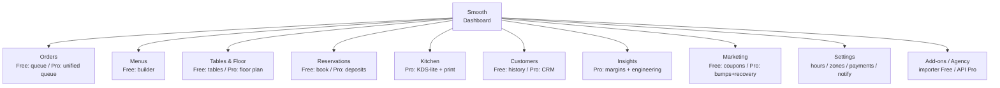

# 14 — Ideal Product Vision

> [!abstract] What this is
> The build-toward doc for **Smooth Restaurant — [[01-vision-problem|The restaurant operating system for WordPress]]**.
> Pillars: **Sell → Schedule → Operate → Optimize** (see [[09-whitespace-gaps]]).
> Locked: independent product under smoothplugins.com (no Arraytics/WPCafe affiliation) — full suite (menu, ordering, reservations), **STANDALONE — no WooCommerce dependency**, 100 web vitals, agency/developer bar (docs, API, headless). If it doesn't serve [[03-personas-jtbd|owner / staff / diner / agency]], it doesn't ship.

> [!success] North-star (proposed to close [[01-vision-problem#North-star]])
> For owners who lose money to phone chaos, slow pages, and 5-plugin maze, Smooth Restaurant is the restaurant operating system for WordPress that gets menu live in <1 day and diners paid in <60s — unlike WPCafe, Orderable, GloriaFood — with no commission, no hardware, you own everything, at highest speed.

## 1. Product principles

1. **Calm on Friday night beats clever every day.**
   > Implication: every screen must survive rush load, offline Wi-Fi, and one-handed staff use — or it doesn't ship.
2. **Diner is on phone, in a hurry, with 3% battery.**
   > Implication: public flows are mobile-first, <60s to paid, no account required, no page reloads to lose a cart.
3. **Speed is a feature, not a setting.**
   > Implication: 0 KB on non-Smooth pages, conditional assets only via `smooth_should_load()`, budgets enforced in CI — see [[06-technical-architecture]].
4. **Generous Free, no nagware; Pro runs you better.**
   > Implication: menu, ordering, reservations, QR-view live in Free; Pro monetizes capacity, kitchen, floor, margins — never paywalls basics (anti-Five-Star-nag, see [[12-competitor-deep-dive]]).
5. **One timeline, not three modules.**
   > Implication: booking → seating → order → kitchen → served → paid is a single unified timeline (Pro), not separate menu / reservation / order silos.
6. **Standalone core, agency-extensible.**
   > Implication: no WooCommerce, no Elementor dependency; everything via blocks, REST, hooks/filters, headless-ready from day 1.
7. **Profit, not just sales.**
   > Implication: every Pro ops screen answers "which dishes make money?" (food-cost, margin, 86, waste) — not just "what did I sell?".

## 2. Information architecture

### 2.1 Admin menu tree



```
Smooth
├── Dashboard (Free — today: sales, live orders, tables, alerts)
├── Orders (Free: list, live view, print / Pro: cross-channel queue, custom statuses, offline recovery)
├── Menus (Free: categories, items, variations & add-ons, 86 flag, hours)
├── Tables & Floor (Free: tables, QR codes / Pro: visual floor plan, table sessions)
├── Reservations (Free: 3-tap book, email confirm / Pro: deposits, reminders, no-show scoring)
├── Kitchen (Pro: KDS-lite, receipt builder, pause/resume, live prep-time)
├── Customers (Free: accounts/history / Pro: behavior CRM, loyalty P1)
├── Insights (Pro: sales+product reports, recipe costing, margin, menu engineering, waste)
├── Marketing (Free: coupons / Pro: order bumps, abandoned recovery, gift cards P2)
├── Settings (Free: hours, pickup/delivery, zones+fees, payments / Pro: advanced rules, capacity)
└── Tools (Free: competitor importer, diagnostics-lite / Pro: diagnostics-full, API keys, webhooks)
```

> [!note] Free vs Pro source of truth
> Tiers follow [[04-feature-map#Imported roadmap (ChatGPT research, 2026-09-05) — locked direction]] + [[12-competitor-deep-dive#Unified feature list — tier + effort]]. Where 04 says "WooCommerce payments", read **native standalone payments** per locked decision.

### 2.2 Public screen map + core user flow

```mermaid
flowchart LR
    subgraph ONBOARD["Owner onboarding <1 day"]
      A[Install] --> B[Importer / AI menu import]
      B --> C[Menu builder blocks]
      C --> D[Hours + zones + payments]
      D --> E[Test order]
      E --> F[Go live + QR print]
    end
    subgraph DINER["Diner <60s to paid"]
      Q[Scan QR / link] --> M[Menu <2s]
      M --> K[Cart]
      K --> CH[Checkout 1-page]
      CH --> P[Pay card/wallet/COD]
      P --> CONF[Confirm + live status]
    end
    subgraph STAFF["Staff operate"]
      CONF --> OQ[Order queue]
      OQ --> KDS[KDS-lite / print]
      KDS --> SERV[Served + paid]
      SERV --> TL[Unified timeline]
    end
    TL --> OPT[Insights: margin / 86 / waste]
    F --> Q
```



## 3. Screen-by-screen ideal experience

### (a) Owner onboarding — menu live in <1 day, first order [Free core]

**Goal:** install → menu live → test order → QR on table in one sitting. No docs needed.

| # | Screen | Ideal experience | Free / Pro | Empty / first-run |
|---|--------|------------------|------------|-------------------|
| A1 | Setup wizard | 4 steps, progress saved, skip-anytime: 1) business + hours, 2) menu import/create, 3) fulfillment (pickup/delivery/dine-in) + zones, 4) payments + test order. Pre-fills timezone, currency, default prep-time 15m. | Free | First-run: checklist card on Dashboard with % complete; "Import your menu — paste a URL, drop a PDF or photo (**AI, M3**), or CSV (**M3**)" CTA. Empty: no menu → illustration + 2 buttons: `Import` / `Start from template` (pizza, café, cloud kitchen). **In M1 (first pilots) entry is manual** — the AI import ships in M3. |
| A2 | Menu builder (block-editor-native) | Gutenberg blocks: `Menu Section`, `Menu Item`, `Add-on Group`. Drag/reorder, inline price + photo, variations (size/spice) + add-ons inline. Autosave, revision-safe. No shortcode soup. No Elementor required (optional compat widget only). | Free (variations & add-ons Free — weapon vs Orderable, see [[12-competitor-deep-dive]]) | Empty category: ghost items + "Add your first dish" + AI-import hint. First item: inline tip "Add-ons lift AOV 12% — add extra cheese? (Pro bumps later)". |
| A3 | Hours / availability + fulfillment | Weekly hours + holidays + ASAP/scheduled toggle + lead-time + preorder-days in one grid. Delivery zones: drawn polygon + distance-fee fallback. Live validation: "Kitchen closes 22:00 but slot offers 22:30 — fix?" | Free (date slots, ASAP, holidays Free; max-orders-per-slot + capacity-aware = Pro) | Empty zones: map placeholder + "Draw first zone". No hours set: banner "You are closed to diners until hours are set". |
| A4 | Payments | Native: Stripe, PayPal, wallets (Apple/Google Pay), COD/cash, pay-at-table. Test-mode toggle, webhook health badge. No Woo install. | Free core gateways; Pro: deposits, tips, saved split logic | Empty: "Connect Stripe (2 min)" + COD fallback so owner can go live without gateway. |
| A5 | Go-live + QR kit | One click: publish menu page, print-ready QR cards (per table + storefront), share link + `?table=T4` deep links. Diagnostics check: assets 0KB elsewhere, cache warm, email deliverable. | Free: QR view + print; Pro: table sessions, floor plan | First-run confetti + "Send yourself a test order" + Dashboard checklist ticks to 100%. |

### (b) Diner — QR / menu → cart → checkout → pay in <60s on mobile [Free core]

**Budget:** menu TTI <1.2s on 4G, checkout <1.5s. No login required. All state survives reload.

| # | Screen | Ideal experience | Free / Pro |
|---|--------|------------------|------------|
| B1 | QR landing / menu | Scan → table-aware header ("You're at Table 4 — dine-in") in <1s, cached menu <2s, photos lazy, 86'd items auto-hidden or greyed with "sold out". Search + category sticky nav + veg/spicy filters. | Free: QR view, manual 86 flag. Pro: auto-86 from ingredient stock, live prep-time ("ready in ~20m"). |
| B2 | Item sheet | Bottom-sheet, big thumb targets, variations as radio, add-ons as stepper, live price math, allergen line. "Add — $12.50" sticky. | Free |
| B3 | Cart | Slide-over, edit qty inline, scheduled vs ASAP picker with honest slots ("next: 8:05 PM — kitchen busy" when Pro capacity-aware; static lead-time in Free). No page jump. | Free: lead-time slots. Pro: capacity-aware throttling + intelligent prep-time. |
| B4 | Checkout (1-page, block-native) | Name + phone only (email optional), fulfillment toggle, address autocomplete only if delivery, tip (Pro) collapsed, coupon inline, payment sheet (card/wallet/COD). Single `Pay` button, idempotent submit (double-tap safe). | Free: mobile-first checkout, coupons. Pro: tips, order bumps ("Add garlic bread?"), custom fields. |
| B5 | Confirmation + live status | Instant confirm screen + order number + ETA that updates (Received → Fired → Ready → Served). "Add to Apple Wallet / SMS updates" opt-in. No account needed; receipt + reorder link. | Free: on-site + email status. Pro: SMS/WhatsApp live updates, custom statuses. |

Empty / edge states (diner):
- Closed restaurant: friendly "Opens 11 AM — preorder for 11:15?" not dead-end.
- Empty cart: best-sellers carousel + "Most reordered".
- Payment fail: preserve cart, inline retry, COD fallback offered.
- Offline: queued submit with "We'll fire when you're back" (Pro offline-first where feasible).

### (c) Staff — order queue, KDS-lite, table / floor view

| # | Screen | Ideal experience | Free / Pro | Empty / first-run |
|---|--------|------------------|------------|-------------------|
| C1 | Order queue (Ops home) | Single cross-channel queue: web + QR + manual/phone. Columns: New / Fired / Ready / Served. One-tap fire, bump, refund-split. Sound + badge on new. Pause/resume per service ("pause delivery 20m") visible to diners instantly. | Free: list + live view + print. Pro: unified queue, custom statuses, pause/resume, offline auto-recovery. | Empty: "No orders yet — here's a test order" + shortcut to QR. First-run: 60s tour overlay, keyboard hints (`F` fire, `R` ready). |
| C2 | KDS-lite | Kitchen tablet view: big cards, timers (green/amber/red), coursing + fire-times, allergen flags, bump bar. Auto-refresh without flicker, survives Wi-Fi drop and re-syncs. | Pro (core moat; receipt builder Pro) | Empty: "Kitchen clear 🎉" + prep checklist. First-run: "Pin this tab in kitchen" + print-fallback pairing. |
| C3 | Tables & floor | Table list with status (free / seated / ordered / needs-bill) in Free; drag-drop visual floor plan in Pro with covers, active sessions, and one-tap move/merge. QR reprint per table. | Free: tables. Pro: floor plan + table sessions (fixes WPCafe's broken QR promise). | Empty: 4 default tables + "Draw your floor" CTA. First-run: import tables from CSV or auto-generate. |
| C4 | Manual / phone order | Staff creates order in <30s: pick table, add items, take payment link. Same pipeline as diner. | Free: create; Pro: deposits + split logic | — |

> [!warning] Offline-first
> Queue + KDS cache last-known state, queue mutations locally, auto-recover on reconnect (Pro). Toast proves viable at $$$ — Smooth does it in WP (see [[09-whitespace-gaps#The 5 bets]]).

### (d) Owner ops — reservations, deposits, analytics / margins

| # | Screen | Ideal experience | Free / Pro | Empty / first-run |
|---|--------|------------------|------------|-------------------|
| D1 | Reservations calendar | Day/week agenda + table assignment, 3-tap book (date → slot → guests), capacity-aware (tables + kitchen together). No-show badge per guest. | Free: book + email confirm. Pro: visual assign, reminders, deposits, no-show scoring + auto-deposit. | Empty day: "No bookings — share link" + template for peak push. First-run: default party sizes + turn-time 90m. |
| D2 | Deposits & reminders | Rule builder: "Fri–Sat >4 guests → $10/head, refund 4h before". Auto email free; SMS/WhatsApp Pro with delivery receipts. | Pro | Empty: "You lost ~X to no-shows last month — enable deposits?" (once Insights has data). |
| D3 | Insights (Optimize) | Three tabs: Money (revenue, AOV, tips), Menu (top dishes, stars/plowhorses/puzzles/dogs auto-engineering), Margins (recipe cost → food-cost % → margin/dish, waste log). Plain-English callouts: "Margherita is star but 38% food-cost — drop olives?" | Pro (advanced analytics/sales+product reports Pro; basic order list Free) | Empty: sample-data toggle + "Connect 7 days of orders to unlock margins". First cost: guided recipe (flour 200g × $...) with unit converter. |
| D4 | Inventory-lite → 86 | Ingredient list tied to items; stock hits zero → auto-86 + staff alert. Manual 86 toggle always (Free). Waste log (spoil/over-prep) feeds margin. | Free basic flag / Pro advanced auto-86 + recipe + waste | Empty: "Track 3 key ingredients first (cheese, dough, chicken)" progressive disclosure. |
| D5 | Customers | History + reorder + notes in Free; behavior CRM (frequency, AOV, favorites), loyalty points, abandoned-order recovery in Pro. | Free history / Pro CRM + loyalty + recovery | Empty: "First 10 regulars will appear here" + invite-to-review link. |

## 4. Design system notes

> [!success] Canonical system locked 2026-09-06 in [[17-ui-ux-design]]
> Feel (calm neutral ops-tool), Herb & Charcoal tokens, inherit+system type, split density, subtle motion, strict token contract. The bullets below are the implementation-facing summary — **17 is authoritative** on look-and-feel.

- **Mobile-first, accessible:** min 44px targets, AA contrast, full keyboard + screen-reader flow for checkout and KDS, `prefers-reduced-motion` respected, RTL + WPML/Polylang strings from day 1 (WPCafe scar: bad i18n).
- **Block-editor-native menu builder:** `menu-grid`, `menu-item`, `reservation-form`, `order-status` blocks with `theme.json` tokens; works in any FSE theme; **no Elementor dependency** (optional thin compat layer only, never required). Server-rendered HTML, hydrated islands — no SPA shell.
- **Tokens:** `--smooth-*` CSS vars (full table in [[17-ui-ux-design#2. Color + tokens]]); diner flows inherit theme fonts, admin/queue/KDS use the OS system stack — **zero webfonts shipped**; dark KDS theme + light FOH theme; print stylesheet for receipts/QR cards.
- **Patterns:** bottom-sheet (diner), queue cards (staff), agenda (reservations), insight callouts (owner). One SVG icon set, one empty-state illustration style, one toast system.
- **Agency kit:** Storybook-style pattern previews, `smooth_*` hooks documented per screen in SRS, REST `/smooth/v1/*` + webhooks, headless menu JSON + Next.js starter (see [[06-technical-architecture#Agency / developer bar]]). Docs Free / API extras Pro.
- **No nagware:** Pro upsells appear contextually once (e.g., floor plan empty state) with dismiss-forever; never banner-inject in Free flows (anti-Five-Star pain).

## 5. Performance budgets per screen

> Philosophy: conditional load only; WPCafe lesson ~820K JS + 475K CSS unconditional must never regress. Target 100 web vitals; 50k users on 1 CPU/4GB via cached menus/availability, no N+1, non-blocking webhooks.

| Surface | JS+CSS budget (gz) | TTI target (Moto G4 / 4G) | Notes |
|---------|-------------------|---------------------------|-------|
| Non-Smooth pages | **0 KB** | no impact | `smooth_should_load()` gate, CI fails on leak |
| Menu (public) | ≤50 KB | <1.2s, LCP <1.5s | cached HTML + JSON, lazy images, no jQuery |
| Item sheet + cart | +20 KB (island) | <0.3s interaction | no full reload, memoize rules/slots |
| Checkout + pay | ≤80 KB total | <1.5s | Stripe Elements lazy only on pay step |
| QR landing | ≤30 KB | <1.0s | table token + transient, edge-cacheable |
| Reservation widget | ≤40 KB | <1.2s | rate-limited endpoints, honeypot + nonce |
| Owner Dashboard | ≤120 KB | <1.5s | paginated, background jobs for reports |
| Order queue | ≤80 KB | <1.2s, poll 5s w/ ETag | websocket-ready, fallback polling |
| KDS-lite | ≤60 KB | <1.0s, 3s tick w/o flicker | offline cache + auto-recovery (Pro) |
| Insights | ≤100 KB + charts lazy | <1.8s | pre-aggregated tables, async cron rollups |
| Server | p95 order-create <400ms, webhook `blocking=>false` | 50k users / 1 CPU 4GB | idempotent migrations, custom tables for orders/bookings at scale |

> [!bug] Diagnostics as feature
> Free: health badge (cache, mail, gateway). Pro: full perf diagnostics (slow-query log, asset audit, update-proof check for theme/plugin conflicts) — turns Orderable/WPCafe "breaks on update" pain into retention.

## 6. Notification matrix

| Event | To Owner | To Staff / Kitchen | To Diner | Channel | Free / Pro |
|-------|----------|-------------------|----------|---------|------------|
| New order | Dashboard badge + sound + email | Queue push + KDS card (+ print if paired) | Confirm screen | On-site + email | Free |
| Status change (fired/ready/served) | Timeline tick | KDS timer move | Live status update | On-site + email Free; SMS/WhatsApp Pro | Free / Pro |
| New reservation | Email + calendar block | Host view ping | Confirm + add-to-calendar | Email | Free |
| Reminder 24h/2h | Digest | — | Reminder + modify link | Email Free; SMS/WhatsApp Pro | Free / Pro |
| No-show risk / deposit required | Alert + auto-deposit log | — | Pay-deposit link | Email + SMS/WhatsApp | Pro |
| 86 / sold-out | Alert | KDS flag | Menu greys out | On-site + email to staff | Free manual / Pro auto |
| Capacity throttle ("next slot moved") | Notice + override | Queue banner | Honest slot copy | On-site | Pro |
| Abandoned cart/order | — | — | Nudge + one-tap resume | Email Free? SMS/WhatsApp Pro | Pro (recovery) |
| Daily close (EOD) | Revenue + top dishes + waste summary | — | — | Email | Free summary / Pro margins |
| System (update, webhook fail, mail fail) | Diagnostics alert | — | — | Admin notice + email | Free basic / Pro full |

Rules: diner opts in for SMS/WhatsApp at checkout (GDPR log); staff sounds mutable; all sends queued via Action Scheduler, retry 3×, idempotent keys; no marketing SMS without consent.

## 7. What is deliberately NOT in the ideal product (anti-features)

- **Not a WooCommerce skin.** No Woo dependency, no block-checkout patching, no Woo update roulette (vs Orderable pain).
- **Not Elementor-dependent.** No Elementor widgets required; page-builder-agnostic blocks only.
- **Not a POS-hardware / delivery-fleet app.** No card readers, no driver dispatch, no payroll — integrate via API/webhooks, don't rebuild Toast/Square hardware.
- **Not a theme or layout pack farm.** No 40 demo imports; one fast FSE starter + tokens (WPCafe layout-pack bloat is out).
- **Not a multivendor marketplace in V1.** Single-brand, multi-location (Pro) only; no commission splitting, no vendor dashboards.
- **Not a native mobile app.** PWA-installable KDS/queue only; no App-Store maintenance.
- **Not a marketing automation suite.** Coupons Free, bumps/recovery/loyalty Pro — but no email-builder, no ads manager; hand off to Mailchimp/FluentCRM via webhooks.
- **Not extraction.** No commission, no per-order fee, no hosted lock-in, no TAX-ID gate (anti-GloriaFood/Toast); self-hosted data ownership is the wedge.
- **Not nagware.** No "Unlock Premium!" banners in Free flows; one contextual upsell max, dismiss-forever.

## 8. Traceability

- Personas/JTBD → [[03-personas-jtbd]] (owner pays, staff operates, diner <60s, agency channel)
- Scope/tiers → [[04-feature-map]] + [[12-competitor-deep-dive#Unified feature list — tier + effort]]
- Moat bets → [[09-whitespace-gaps#The 5 bets]] (capacity-aware, ingredient→86, unified timeline, offline-first, margin intelligence)
- Architecture → [[06-technical-architecture]] (shared layer, conditional assets, standalone)
- Next: SRS per screen + [[07-roadmap-milestones]] exit criteria (menu-live <1 day, order <60s, TTI budgets green).

> [!success] Founder decisions — CLOSED 2026-09-06
> - **Payments scope:** Stripe (cards + Apple/Google Pay via Payment Element) + PayPal + COD **day 1**; COD always available so an owner can go live without a gateway.
> - **Free generosity line:** **Free = take the order** (menu, ordering, pickup, QR view, coupons, dashboard, 86, importer/AI-import). **Pro = run the rush** (capacity-lite slot caps, honest prep-time, sales/product reports, pause/resume, bumps/tips, QR sessions, floor plan, deposits). This is also the upgrade reason for takeaway/cloud-kitchen, the highest-WTP segment.
> - **Migration:** competitor importer ships **Free in M3** with a switch campaign ([[10-marketing-plan]] step 5) — external switch, no "own upgrade" path.
> - **Onboarding gap:** CSV + competitor importer are **deferred out of M1**; **AI menu import (URL / PDF / photo → structured menu)** ships in **M3** and is the thing that actually defends "menu live <1 day" (A1/A2 above).
> - **Wave names:** A1–A5 map to [[07-roadmap-milestones]] M1/M3 — anything marked "M3" or "M5" here is not in the first pilot build.

## 9. External references

- Payments UX: [Stripe Payment Element](https://docs.stripe.com/payments/payment-element) · [PayPal Smart Buttons](https://developer.paypal.com/docs/checkout/standard/integrate/) · [Apple Pay on web](https://developer.apple.com/documentation/apple_pay_on_the_web)
- Accessibility floor: [WCAG 2.2 quickref](https://www.w3.org/WAI/WCAG22/quickref/) · [WP accessibility handbook](https://developer.wordpress.org/coding-standards/wordpress-coding-standards/accessibility/)
- Blocks: [Block Editor handbook](https://developer.wordpress.org/block-editor/) · [`theme.json`](https://developer.wordpress.org/block-editor/how-to-guides/themes/theme-json/) · [Interactivity API](https://developer.wordpress.org/block-editor/reference-guides/packages/packages-interactivity/) (islands without SPA shell)
- Ops vocabulary to copy: [Square KDS](https://squareup.com/us/en/point-of-sale/restaurants/kitchen-display-system) (86, coursing, timers) · [Toast offline mode](https://central.toasttab.com/s/article/Offline-Mode-Using-Toast-During-a-ISP-Outage)
