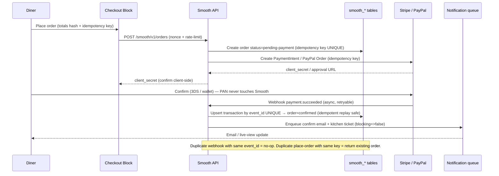
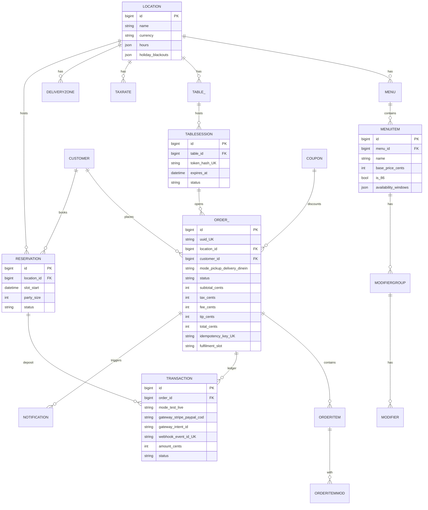

# 15 — Standalone Strategy (No WooCommerce)

> [!abstract] Locked thesis
> [[06-technical-architecture|D1]] is **LOCKED: standalone-native**. No WooCommerce dependency. Everything — cart, checkout, payments, orders, notifications — is built from scratch for a performance + reliability edge.
> [!success] Implementation moved
> Why-standalone narrative stays here. All build specs (C1–C12, payments, storage, schema, importer, R1–R6, phases) are now canonical in **[[16-technical-details]]** — edit there.

> [!success] Founder lock — D1 native
> Standalone wins because competitors' #1 complaint cluster is Woo-induced: Orderable breaks on Woo updates + block-checkout incompatibility, WPCafe inherits Woo bloat + unconditional assets. Square/Toast prove deep ops is the moat, but with hardware + processing lock-in. Smooth takes the fourth path: **WordPress-native ops depth, no Woo, no hardware, no commission.**

## 1. Why standalone wins

> [!tip] The pitch in one line
> Faster pages, fewer fatals, checkout that never fights Woo Blocks — and you own the ledger.

| Win | Mechanism | Evidence |
|-----|-----------|----------|
| **Performance** | No Woo + no Woo cart/checkout/session overhead. Conditional assets only (`smooth_should_load()` gate from day 1). Cached menu/availability, no per-cart N+1. Target: **0 KB on non-Smooth pages; per-surface budgets in [[16-technical-details#7. Performance budgets]]** (≤80 KB max gz). | WPCafe scar (external): ~820K JS + 475K CSS unconditional; BE1/BE2/BE5/BE12 N+1 fixes were retrofits — see [[WPCafe]]. Smooth starts clean per [[04-feature-map#Scope guardrails]]. |
| **No breakage-on-update** | Woo major/minor updates are the top Orderable support-forum thread (timeslot bugs, cart AJAX glitches, block-checkout incompatibility). Standalone removes the entire failure surface: no WC version matrix, no HPOS compat shim, no fragment API drift. | [[12-competitor-deep-dive#2. Orderable — the execution benchmark]] |
| **No Woo bloat** | Woo installs ~40+ tables, scheduled actions, admin columns, marketing nags, onboarding wizards — even for a restaurant that only needs menu → cart → pay → kitchen. Standalone installs 6–8 lean tables, one cron group, one capability map. | GloriaFood users praise "simple"; Five Star users hate nagware — [[12-competitor-deep-dive#Top pain themes]] |
| **Block-checkout-native** | Checkout is a Gutenberg block (`smooth/checkout`) from day 1, not a shortcode fighting Woo Blocks. Mobile-first, <60s order per [[04-feature-map#V1 slice]]. Express wallets (Apple Pay / Google Pay via Stripe Payment Element) inline, no Woo Blocks bridge plugin. | Orderable's #1 complaint thread = Woo block-checkout incompatibility |
| **Data ownership story** | No Woo customer/order coupling, no GloriaFood TAX-ID/hosted lock-in. Owner exports CSV + owns SEO/site/data. Matches USP: *"No commission, no hardware, you own everything"* — [[12-competitor-deep-dive#USP (post-research, final)]] |
| **Ops vocabulary freedom** | 86 flags, coursing, fire times, KDS timers, capacity-aware slots — modeled as first-class entities, not shoehorned into Woo product/coupon/shipping abstractions. | Square/Toast reference in [[12-competitor-deep-dive#5. SaaS reference]] |

## 2. What it costs — full build-from-scratch inventory

> [!warning] No free lunch
> Woo gave us this for free. Now we own every line — and every money bug. Budget accordingly in [[07-roadmap-milestones]] Wave 1.

| # | Subsystem (was Woo) | Must build native | Notes / WPCafe lesson |
|---|---------------------|-------------------|-----------------------|
| C1 | **Cart + sessions** | Server-validated cart (draft order), guest + logged-in, QR table-session attach, abandon TTL (e.g. 2h), request-scope memoization | WPCafe BE3 kept native PHP sessions deliberately; Smooth: **do not use PHP sessions** — use signed cookie + `smooth_carts` table + object-cache. Avoids host session breakage. → [[06-technical-architecture]] D6 |
| C2 | **Checkout + totals engine** | Fulfilment mode (pickup/delivery/dine-in), slots + lead time + holidays, address + delivery-zone validation, tips, fees, coupons, tax. Single `Totals::calculate()` pure function, unit-tested | WPCafe BE2: per-cart discount N+1 → memoize rules/slots per request from day 1 |
| C3 | **Tax / fee engine** | Per-location tax rates (inclusive/exclusive), delivery distance fees, service fees, tip base rules, rounding policy (per-line vs per-total, documented). Pro later: VAT classes, multi-rate | Keep V1 to one rate per location + one fee stack; extensible via `smooth_totals_adjustments` filter |
| C4 | **Payment integrations** | Stripe (PaymentIntents + Payment Element + Express wallets), PayPal (Checkout Orders API), COD / Pay-at-counter. Test mode + live mode key pairs, webhook handlers. See §3 | PCI SAQ-A only — never touch PAN. Details §3 |
| C5 | **Order storage** | Custom tables `smooth_orders` + `smooth_order_items` + `smooth_transactions` (ledger). Not CPT. See §4 / D4 | WPCafe BE5 (revenue N+1) + BE11 (invoice double-scan) prove postmeta doesn't scale to 50k+ rows |
| C6 | **Scheduled-order engine** | ASAP vs scheduled, lead-time, preorder-days cap, holiday blackouts, capacity cap per slot, pause/resume per service. Slot matrix memoized per request | Orderable's recurring pain = timeslot bugs. This is the #1 correctness investment after payments |
| C7 | **Notification queue** | Async queue table (`smooth_notifications`) + Action Scheduler or own cron worker: order confirm, status change, reservation confirm/reminder, admin live view. Email day 1 (wp_mail + SMTP hint); SMS/WhatsApp Pro+ via provider abstraction on **restaurant-owned credentials (BYO — locked 2026-09-06)** | WPCafe BE4 lesson: all provider calls `blocking => false`, non-blocking, retried with backoff |
| C8 | **Order dashboard + statuses** | Custom statuses (`pending → confirmed → preparing → ready → completed / cancelled / refunded`), live view (polling day 1, websocket later), receipt print, capability-gated (`smooth_manage_orders`) | GloriaFood lacks admin control — this is a steal-gap per [[12-competitor-deep-dive]] |
| C9 | **Refunds / voids / reconciliation** | Refund via gateway API + ledger reversal entry (never delete), daily reconciliation report (gateway payouts vs ledger), void-before-capture for auth-capture flow | Payments bugs are money bugs — §8 |
| C10 | **Importer from Woo rivals** | Map Woo products/variations/coupons → native menu items/modifiers/coupons. Sources: Orderable (Woo products + `_orderable_*` meta), WPCafe (Woo products + `wpc_*` meta), FoodBook/others (generic Woo product fallback). Dry-run + idempotent re-run | See §7 migration story. This is the distribution weapon — [[12-competitor-deep-dive]] lists it Free/M |
| C11 | **Security / abuse** | Nonces + capability checks on every mutation, rate-limit booking/checkout endpoints, SSRF-safe webhook allowlist, honeypot + per-IP throttle on QR/cart endpoints | WPCafe SEC2 (webhook SSRF) must not be repeated |
| C12 | **Telemetry / diagnostics** | Opt-in funnel (activation → menu-live → first-order), system-status panel (tables, cron health, webhook last-seen, asset budget check). Update-proofing as a feature | Direct answer to pain theme #1: bugs/fatals on update |

## 3. Payment strategy without Woo

> [!danger] Money rules
> Every charge path needs: idempotency key → gateway → ledger entry → webhook reconcile. No exceptions. A payment bug is a charge-twice / lose-money bug.

### 3.1 Providers day 1 vs later

| Tier | Provider | Integration | Day 1 scope |
|------|----------|-------------|-------------|
| Day 1 | **Stripe** | PaymentIntents API + Payment Element (cards + Apple Pay / Google Pay express). `capture_method: automatic` V1 (auth-capture later for deposits) | Cards + wallets, test/live keys, 3DS handled by Element |
| Day 1 | **PayPal** | Checkout Orders API v2 (Smart Buttons, server-side capture) | Capture on place-order, refund via API |
| Day 1 | **COD / Pay-at-counter / Bank** | Manual method, no gateway call, order → `pending-payment` → staff marks paid | Essential for pilot restaurants |
| Later (Pro) | Stripe Terminal / reader, reservation deposits (auth + capture split), split payments, gift cards, multi-currency (Stripe `currency` per location), subscriptions (meal plans) | — | Explicitly NOT in MVP — see §9 |

### 3.2 PCI strategy — stay in SAQ-A

- **Never handle PAN.** Card fields are Stripe-hosted iframes (Payment Element) or PayPal-hosted buttons. Smooth servers see only `payment_method_id` / PayPal `orderID` — never card numbers.
- TLS everywhere, no card data in logs/DB/transients. `smooth_transactions` stores only: gateway, gateway intent/order id, amount, currency, status, idempotency key, webhook event id.
- Self-assessment: **SAQ-A** (card-data outsourced), documented in agency kit per [[06-technical-architecture#Agency / developer bar]].
- 3DS/SCA delegated to Stripe/PayPal hosted flows — no custom challenge handling in V1.

### 3.3 Webhooks — idempotent + non-blocking

Rules (hard gates, from WPCafe BE4 + SEC2/SEC3 scar tissue):

- `blocking => false` on all outbound provider calls except the synchronous charge-creation itself; webhook *receivers* respond `200` fast, then process via Action Scheduler.
- Every webhook handler: **verify signature** (Stripe `constructEvent`, PayPal transmission verify) → **allowlist + SSRF-safe fetch** → **idempotency on `event_id` UNIQUE column** → state-machine transition guard (e.g. `pending-payment → confirmed`, never `refunded → confirmed`).
- **Test mode:** separate test keys + test webhook secret + sandbox dashboard banner + one-click "test payment" ($1 auth + void) in system status. Test and live ledgers never mix (`mode` column on every transaction).
- Migrations that add webhook columns are version-guarded + idempotent (WPCafe SEC3 lesson: never ship with the guard commented out).

## 4. Storage — D4 recommendation (custom tables, not CPT)

> [!info] Recommendation
> **Custom tables for all transactional entities. CPT only as an optional display mirror for menu items if SEO/block-query needs it — never as the source of truth for orders, payments, or reservations.**

| Entity | Store | Why |
|--------|-------|-----|
| Menu categories / items / modifiers | Custom tables (`smooth_menus`, `smooth_menu_items`, `smooth_modifiers`) + block bindings; optional CPT mirror later | Query speed for 500+ item menus, variation/add-on pricing without postmeta joins; avoids WPCafe product-endpoint cap saga (BE13) |
| Orders / order items | `smooth_orders` + `smooth_order_items` | Ledger queries (revenue/day, top dishes) become indexed `GROUP BY`, not N+1 postmeta scans (WPCafe BE5) |
| Transactions / refunds | `smooth_transactions` (append-only ledger) | Reconciliation report + idempotency keys need UNIQUE constraints — postmeta can't do this |
| Reservations / tables / sessions | `smooth_reservations`, `smooth_tables`, `smooth_table_sessions` | Time-range queries (`WHERE start BETWEEN … AND status`) need real indexes; CPT `meta_query` collapses at 50k+ bookings (WPCafe BE11) |
| Coupons / zones / slots / hours | `smooth_coupons`, `smooth_zones`, `smooth_slots_cache` (computed) | Rule evaluation per-cart must be single-query + memoized, not per-rule post scan |
| Notification queue | `smooth_notifications` (status, attempts, next_try) | Retry/backoff + admin visibility; options/transients evict and lose money-mail |

CPT is rejected as source of truth because: postmeta is EAV (one row per field → N+1), `meta_query` range scans don't index well, invoice/order lookups double-scan, and HPOS taught the ecosystem the same lesson. Keep one idiomatic exception: if a theme/SEO plugin needs menu items in `WP_Query`, ship a read-only CPT sync as a Pro toggle — never dual-write in the hot path.

## 5. Scope delta vs the Woo-based MVP

> [!question] What changes if Woo is gone?
> Short answer: checkout + payments get **bigger** (we build the engine), everything else gets **simpler** (no compat matrix, no bridge plugins, no "works with your theme's Woo templates" support queue).

| Gets BIGGER (new build) | Gets SIMPLER (deleted work) |
|-------------------------|-----------------------------|
| Cart/checkout/totals engine (C1–C3), gateway integrations + webhooks + ledger (C4/C9), slot engine hardening (C6), importer (C10) — roughly +4–6 weeks vs Woo-MVP | No Woo onboarding/dependency nag, no HPOS compat, no Blocks-vs-shortcode checkout war, no Woo-settings conflict support, no per-theme Woo template overrides, smaller install footprint, faster QA matrix (WP × PHP only, not × Woo × gateway-plugin) |
| Notification queue + reconciliation report (C7/C9) must exist day 1, not "Woo emails handle it" | Docs get shorter: one way to pay, one order screen, one status model |

### Revised MVP feature list (standalone-native)

Free (must demo "menu live in 1 day, order in <60s, book in 3 taps"):

- [ ] Menu builder (categories, items, images, prices) + variations & add-ons (weaponized Free per [[12-competitor-deep-dive]])
- [ ] Native cart + block checkout (**pickup + QR dine-in at M1; delivery + zones → M3**), ASAP + scheduled, lead time + holidays + opening hours
- [ ] Payments: Stripe + PayPal + COD, test mode, idempotent webhooks
- [ ] Order dashboard + live view + print, statuses through `ready/completed`
- [ ] Reservations (3-tap) + email confirm (deposits/reminders → Pro)
- [ ] QR menu view (Free); **QR table sessions → Pro Single, built in Wave 1 MVP** (QR-first lock 2026-09-06, D6)
- [ ] 86 flag; **coupons → M3**; **pause/resume → Pro (M3)**
- [ ] Conditional assets + cached menu/config + minimal health badge (full diagnostics → M3)

> [!warning] Deferred out of M1 (locked 2026-09-06)
> Competitor importer, CSV import, **AI menu import** (URL/PDF/photo → structured menu, ships **M3**), delivery zones + distance fees (**M3**). **Pilots enter menus by hand** — the "menu live <1 day" claim is defended by AI menu import at M3, not by CSV in M1.

Pro V1 (first paid gate, right after pilot):

- [ ] QR table sessions + visual floor plan, deposits + reminders (SMS/WhatsApp/email, **BYO credentials**), custom statuses + driver notifications, order bumps + tips, receipt builder, **pause/resume**, **capacity-lite slot caps + honest prep-time + basic sales/product reports** (the Pro "run the rush" value → **M3**)
- [ ] **Kitchen-load capacity throttle, KDS-lite, multi-location, advanced analytics + margins → M5 (V2b)** — explicitly not at launch; launch is sold honestly as single-location

Deliberately NOT in MVP: subscriptions, split checks, multi-currency, Terminal hardware, MarketMan-style ingredient costing (all §9 later).

## 6. Data model sketch

> [!note] Money invariants
> Amounts in **integer cents**, one currency per order, `ORDER_.total = subtotal + tax + fee + tip − discount` recomputed server-side on every mutation (client totals are display-only). `TRANSACTION` is append-only — refunds are new rows, never updates. `idempotency_key` and `webhook_event_id` are UNIQUE.

## 7. Migration story — stealing Woo-based users

> [!example] Gut check
> Importer must map **Woo products → native menu items** (including variations → modifier groups), Woo coupons → native coupons, and optionally Woo orders → read-only history. If it can't do a 200-item Orderable menu in one dry-run without data loss, it doesn't ship.

| Source | What we read | Map to native | Gotchas |
|--------|--------------|---------------|---------|
| **Orderable** (Woo) | `product` CPT + `product_variation`, `_orderable_*` meta (slots, lead time, location), Woo coupons | Items + modifier groups + slot rules + coupons; slot caps → native slot engine (flag static-cap vs capacity-aware) | Timeslot semantics differ — import as draft rules + admin review screen, never silent |
| **WPCafe** (external competitor, Woo) | `product` CPT + `wpc_*` meta, food-menu shortcode config, location taxonomy, reservation CPT | Same as above + reservation history + location taxonomy → `LOCATION` rows | Shortcode soup → Gutenberg blocks need a layout-mapping pass; QR sessions broken in WPCafe so no session import — start fresh |
| **FoodBook / generic Woo food** | `product` CPT + `product_cat`, variations, Woo coupons/shipping zones | Generic fallback mapper (name/price/image/desc/variation) + zone → delivery-zone draft | Unknown meta namespaced under `smooth_import_raw` JSON for manual fix-up |
| Woo order history (optional, Pro) | `shop_order` + `woocommerce_order_items` | Read-only `smooth_orders` with `migrated_from='woo:<id>'`, no ledger replay (mark `mode='imported'`, exclude from reconciliation) | Never re-charge; never re-fire webhooks on imported rows |

Importer UX: source auto-detect → dry-run preview (counts + 5 sample rows + warnings) → import with progress + idempotent re-run key (`import_batch_id`, re-run skips existing `external_key`) → post-import checklist (hours, zones, keys, test payment). Ships **Free** — it is acquisition, per [[12-competitor-deep-dive#Unified feature list]].

## 8. Risks + mitigations (payments bugs are money bugs)

| # | Risk | Mitigation |
|---|------|------------|
| R1 | **Double-charge / lost-charge** (race on place-order + webhook replay) | Idempotency keys (UNIQUE) both directions; state-machine guards; automated double-charge detector in reconciliation report; Playwright + PHPUnit contract tests for replay/double-click/offline-retry |
| R2 | **Totals drift** (client vs server, rounding, fee-stack order) | Single pure `Totals::calculate()` + golden-file fixtures (100+ cases: inclusive/exclusive tax, fees-before/after-discount, rounding edges); client sends display hash, server is authoritative |
| R3 | **Slot overbooking** (capacity race at prime time) | Slot reservation via atomic `UPDATE … WHERE remaining > 0` / DB transaction, not read-then-write; capacity-aware throttle (Pro moat) load-tested to 50k users / 1 CPU per [[06-technical-architecture#Agency / developer bar]] |
| R4 | **Webhook loss / spoof** | Signature verify + allowlist, Action-Scheduler retry with exponential backoff, `last_webhook_seen` in system status, daily "payments without webhook" reconciliation query |
| R5 | **Scope creep rebuilds Woo badly** (subscriptions/multicurrency too early) | Hard phase gate §9: native day 1 = charge/capture/refund/COD only; everything else behind Pro + explicit SRS exit criteria per [[07-roadmap-milestones]] |
| R6 | **Support load from gateway onboarding** (keys, webhooks, test-vs-live confusion) | Guided connect wizard (paste keys → auto-register webhook → run $1 test → go-live checklist); diagnostics panel shows key mode + webhook health; docs + agency kit day 1 |

> [!bug] Ledger discipline (non-negotiable)
> Append-only `smooth_transactions`, nightly `SUM(ledger) vs gateway payouts` reconciliation report (CSV + admin notice on mismatch), no admin "edit total" button in V1 (adjust via refund + new charge only). Every money-touching PR needs a second reviewer + a replay test.

## 9. Phased plan — native day 1 vs later

| Phase | Ships native | Explicitly deferred |
|-------|--------------|---------------------|
> Canonical table lives in **[[16-technical-details#12. Phased build]]**. Summary:

| Milestone | Ships native | Hours | Deferred |
|-----------|--------------|-------|----------|
| **M1 Money path** (Wave 1 MVP, QR-first) | Cart/checkout/totals, Stripe + PayPal + COD, custom-table orders/ledger, ASAP+scheduled+lead-time+holidays, email queue, dashboard+print, reservations-lite, **QR table sessions (D6 — Pro feature, built in this wave)**, security, telemetry | 250–350 h | Importer, CSV, AI menu import, delivery/zones, coupons, diagnostics |
| **M3 Launch engine** (V2a) | QR hardening, floor plan, deposits (auth-capture), reminders SMS/WhatsApp (BYO), custom statuses, bumps/tips, receipt builder, capacity-lite + prep-time + reports, coupons, delivery zones, AI menu import + importer, diagnostics | 200–300 h | Subscriptions, split payments, multi-currency |
| **M5 V2b** (post-launch) | KDS-lite, capacity-aware throttle, multi-location, advanced analytics + margins | 200–300 h | — |
| **Later (P2)** | Gift cards, marketing automation, offline-first KDS, ingredient auto-86 + costing, behavior CRM | — | POS hardware / Terminal, delivery-fleet tracking, SaaS-hosted (all per [[07-roadmap-milestones#What we deliberately defer]]) |

## 10. Decision log — recommended picks

| # | Decision | Recommended pick | One-line rationale |
|---|----------|------------------|--------------------|
| D1 | WooCommerce? | **native-standalone — LOCKED** | Removes the #1 complaint surface (Woo-update breakage + block-checkout fights) and buys the performance story competitors can't copy without a rewrite. |
| D4 | Storage (orders/reservations)? | **custom tables for all transactional entities** | Postmeta N+1 + unindexed range scans already failed at WPCafe scale (BE5/BE11); ledger/reconciliation needs UNIQUE + indexed sums CPT can't give. |
| D5 | Payments? | **direct Stripe (PaymentIntents + Element) + PayPal Orders API + COD, SAQ-A, idempotent webhooks** | Keeps PCI scope minimal while owning the checkout UX Woo gateways fragment; test/live split + reconciliation from day 1. |
| D6 | QR sessions? | **table-token + `smooth_table_sessions` row with TTL (not transient)** | Transients evict under object-cache pressure and lose paid sessions; a real row gives expiry, single-active-session-per-table, and an audit trail for dine-in orders. |

> [!todo] Sign-off
> - [x] Founder signs D1/D4/D5/D6 picks (this note) → unblocks [[06-technical-architecture#Decision log]] TODOs — LOCKED 2026-09-05 standalone-native (see [[06-technical-architecture#Decision log]] + README)
> - [ ] Founder (solo — no tech lead exists) signs off the `Totals::calculate()` fixture list + ledger schema before M1 code. **The fixtures *are* the review:** no money path ships without golden-fixture totals tests, webhook-replay, double-click and offline-retry E2E ([[16-technical-details#13.8 AI-assisted development model]])
> - [x] Pilot criteria updated in [[07-roadmap-milestones#Wave detail]]: "real Stripe test payment + real COD order + real booking, zero Woo installed"

## Links

- Scope: [[04-feature-map]] · Architecture: [[06-technical-architecture]] · Waves: [[07-roadmap-milestones]] · Rivals: [[12-competitor-deep-dive]] · Risks: [[08-risks-open-questions]]
- Scar tissue: [[WPCafe]] (unconditional assets, BE2/BE4/BE5/BE11/BE12, SEC2/SEC3)
- North star: [[01-vision-problem#North-star]] · JTBD: [[03-personas-jtbd]]
- External: [Stripe PaymentIntents](https://docs.stripe.com/payments/payment-intents) · [Stripe webhooks](https://docs.stripe.com/webhooks) · [PayPal Orders v2](https://developer.paypal.com/docs/api/orders/v2/) · [PayPal webhooks](https://developer.paypal.com/api/rest/webhooks/) · [PCI SAQ-A scope](https://www.pcisecuritystandards.org/document_library/?category=saqs) · [Action Scheduler](https://actionscheduler.org/) · [HPOS lesson (why custom tables)](https://developer.wordpress.com/2023/02/17/hpos/)
