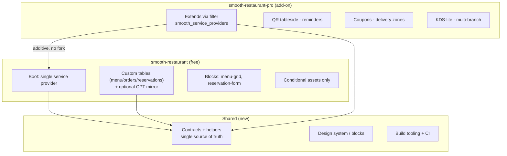
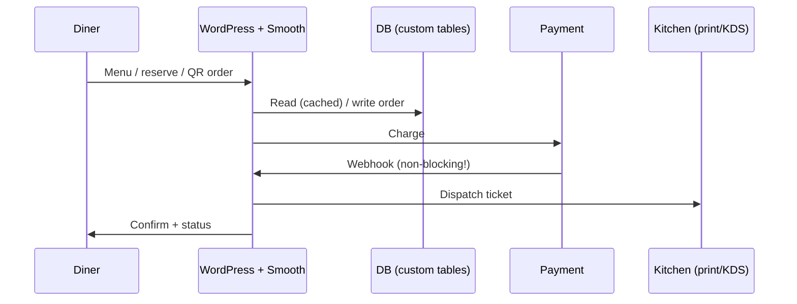
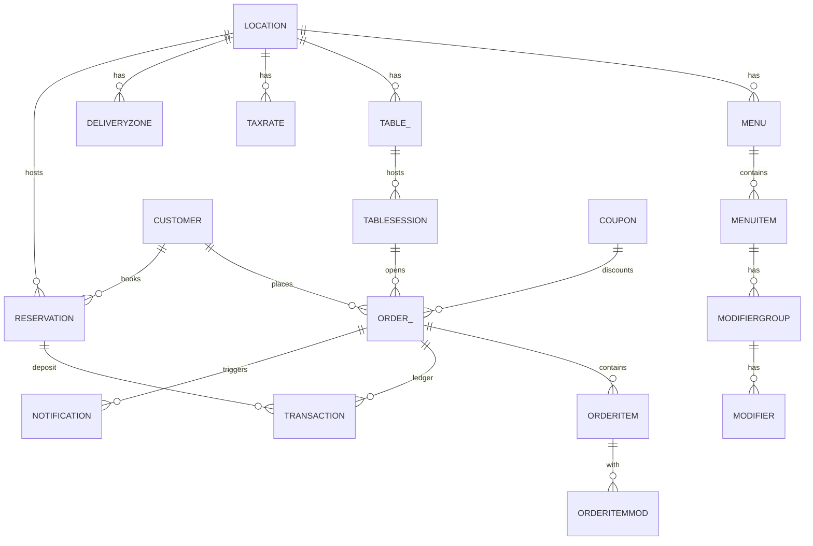

# 16 — Technical Details (canonical home)

> [!abstract] What this is
> Single home for **all technical details and decisions**. Moved here from [[06-technical-architecture]] (shape, D1–D8, flows, budgets, NFRs), [[15-standalone-strategy]] (build inventory C1–C12, payments, storage, data model, importer, risks R1–R6, phases, D-log), [[14-ideal-product]] (§4 design system, §5 perf budgets, notification rules), and [[11-srs-process]] (SDLC + design gate).
> Rule: **edit here, not in the old sections.** 06 keeps the decision picks table, 15 keeps the why-standalone narrative — both link here for implementation detail.

## 1. Decision log (source of truth)

| # | Decision | Pick (locked) | Rationale |
|---|----------|---------------|-----------|
| D1 | WooCommerce? | **native-standalone — LOCKED 2026-09-05** | Removes #1 complaint surface (Woo-update breakage + block-checkout fights); buys perf story. No Woo-bridge before V3. |
| D2 | Free/Pro split | shared-layer (additive, no fork) | Avoids duplication tax; Pro extends via `smooth_service_providers` filter. |
| D3 | Builders | **Gutenberg-first, no Elementor dep** | Block-native checkout + menu; thin compat layer only. Elementor/Bricks support deferred. |
| D4 | Storage | **custom tables for all transactional entities** | Postmeta N+1 + unindexed range scans failed at prior-work scale (BE5/BE11). Ledger needs UNIQUE + indexed sums. |
| D5 | Payments | **direct Stripe (PaymentIntents + Element) + PayPal Orders API + COD, SAQ-A, idempotent webhooks** | Own checkout UX; test/live split + reconciliation day 1. Vendor-of-record for plugin sales: **EDD + Stripe (locked 2026-09-06)**. |
| D6 | QR sessions | **table-token + `smooth_table_sessions` row + TTL (not transient)** | Transients evict; real row gives expiry + single-active-session + audit trail. QR-first MVP (locked 2026-09-06). |
| D7 | i18n / RTL / HPOS | **i18n/RTL day 1; HPOS n/a (no Woo)** | Full strings + WPML/Polylang from day 1; HPOS irrelevant standalone. |
| D8 | Compat floor | **WP 6.8+ / PHP 8.2+ / multisite supported (locked 2026-09-06)** | — |

## 2. Architecture shape

## 3. Request flows

Happy path (diner → WP → DB → payment → kitchen):

Webhook flow (idempotent, non-blocking) — see §5.

## 4. Storage (D4) + data model

Custom tables for all transactional entities. CPT only as optional read-only display mirror for menu items (never source of truth for orders/payments/reservations).

| Entity | Table(s) | Why |
|--------|----------|-----|
| Menu cats / items / modifiers | `smooth_menus`, `smooth_menu_items`, `smooth_modifiers` (+ block bindings) | 500+ item menus without postmeta joins |
| Orders / items | `smooth_orders` + `smooth_order_items` | Indexed `GROUP BY` revenue queries, no N+1 |
| Transactions / refunds | `smooth_transactions` (append-only) | UNIQUE idempotency + reconciliation |
| Reservations / tables / sessions | `smooth_reservations`, `smooth_tables`, `smooth_table_sessions` | Indexed time-range queries |
| Coupons / zones / slots / hours | `smooth_coupons`, `smooth_zones`, `smooth_slots_cache` (computed) | Single-query rule eval + memoize |
| Notification queue | `smooth_notifications` (status, attempts, next_try) | Retry/backoff + admin visibility |
| Carts (guest + login) | `smooth_carts` + signed cookie + object-cache (no PHP sessions) | Host-safe sessions |

Money invariants: integer cents, one currency per order, `total = subtotal + tax + fee + tip − discount` recomputed server-side (client totals display-only). `TRANSACTION` append-only — refunds are new rows. `idempotency_key` + `webhook_event_id` UNIQUE.

## 5. Payments without Woo (D5)

> Money rule: every charge path = idempotency key → gateway → ledger entry → webhook reconcile. No exceptions.

| Tier | Provider | Scope |
|------|----------|-------|
| Day 1 | **Stripe** (PaymentIntents + Payment Element + Apple/Google Pay express, auto-capture) | Cards + wallets, test/live keys, 3DS via Element |
| Day 1 | **PayPal** (Checkout Orders API v2, server capture) | Capture on place-order, refund via API |
| Day 1 | **COD / pay-at-counter** | `pending-payment` → staff marks paid; lets owners go live without gateway |
| Later (Pro) | Deposits (auth-capture split), Terminal, split payments, gift cards, multi-currency, subscriptions | NOT in MVP |

PCI: SAQ-A — never handle PAN (Stripe/PayPal hosted fields only); no card data in logs/DB/transients; TLS everywhere.

Webhook hard gates:
- `blocking => false` outbound; receivers reply `200` fast, process via Action Scheduler.
- Verify signature (Stripe `constructEvent`, PayPal transmission verify) → allowlist + SSRF-safe fetch → idempotency on `event_id` UNIQUE → state-machine guards (never `refunded → confirmed`).
- Test/live ledgers never mix (`mode` column); one-click $1 test payment in system status.
- Version-guarded, idempotent migrations.

## 6. Build inventory (was-Woo C1–C12)

| # | Subsystem | Native build | Key constraint |
|---|-----------|--------------|----------------|
| C1 | Cart + sessions | Server-validated draft order, guest+login, QR attach, 2h abandon TTL, per-request memoize | No PHP sessions |
| C2 | Checkout + totals | Pickup/delivery/dine-in, slots + lead + holidays, zones, tips/fees/coupons/tax; single pure `Totals::calculate()` | Golden-file fixtures 100+ cases |
| C3 | Tax / fee engine | One rate/location + one fee stack V1; `smooth_totals_adjustments` filter | Document rounding (line vs total) |
| C4 | Gateways | §5 | §5 |
| C5 | Order storage | §4 | §4 |
| C6 | Scheduled-order engine | ASAP vs scheduled, lead-time, preorder cap, holiday blackout, per-slot cap, pause/resume | Atomic `UPDATE … WHERE remaining > 0`, never read-then-write |
| C7 | Notification queue | `smooth_notifications` + Action Scheduler; wp_mail + SMTP hint day 1; SMS/WhatsApp Pro+ via provider abstraction, restaurant-owned credentials (BYO — locked 2026-09-06) | Queued, retry 3×, idempotent keys; diner opt-in log (GDPR) |
| C8 | Dashboard + statuses | `pending → confirmed → preparing → ready → completed / cancelled / refunded`; live view (poll 5s ETag day 1); receipt print; `smooth_manage_orders` cap | GloriaFood-gap steal |
| C9 | Refunds / reconciliation | Gateway refund + ledger reversal (never delete); nightly `SUM(ledger)` vs payouts report + mismatch notice | No admin "edit total" in V1 |
| C10 | Competitor importer | Woo products/variations/coupons → native; sources: Orderable (`_orderable_*`), WPCafe (`wpc_*`, external), FoodBook/generic fallback; Woo orders → read-only history | Free; dry-run + `import_batch_id` idempotent re-run; data only, never competitor code |
| C11 | Security / abuse | Nonces + caps on every mutation; rate-limit checkout/booking/QR endpoints; SSRF-safe webhook allowlist; honeypot + per-IP throttle | — |
| C12 | Telemetry / diagnostics | Opt-in funnel (activation → menu-live → first-order); system-status (tables, cron, webhook last-seen, asset budget) | Update-proofing as feature |

## 7. Performance budgets

Philosophy: conditional load only (`smooth_should_load()` gate day 1); CI fails on leak.

| Surface | JS+CSS (gz) | TTI (Moto G4/4G) | Notes |
|---------|-------------|------------------|-------|
| Non-Smooth pages | **0 KB** | no impact | gate + CI check |
| Menu (public) | ≤50 KB | <1.2s, LCP <1.5s | cached HTML+JSON, lazy images, no jQuery |
| Item sheet + cart | +20 KB island | <0.3s interaction | no reload, memoize rules/slots |
| Checkout + pay | ≤80 KB total | <1.5s | Stripe Elements lazy on pay step |
| QR landing | ≤30 KB | <1.0s | edge-cacheable token |
| Reservation widget | ≤40 KB | <1.2s | rate-limited, honeypot + nonce |
| Owner dashboard | ≤120 KB | <1.5s | paginated, bg jobs for reports |
| Order queue | ≤80 KB | <1.2s, poll 5s ETag | websocket-ready |
| KDS-lite | ≤60 KB | <1.0s, 3s tick no flicker | offline cache + auto-recovery (Pro) |
| Insights | ≤100 KB + lazy charts | <1.8s | pre-aggregated tables, async cron |
| Server | p95 order-create <400ms | 50k users / 1 CPU 4GB | idempotent migrations, custom tables |

Diagnostics as feature: Free health badge; Pro full perf diagnostics (slow-query log, asset audit, conflict check).

## 8. Compatibility & NFRs

- [x] WP 6.8+ / PHP 8.2+ / multisite supported
- [x] Security: caps, nonces, SSRF-safe webhooks, rate limits
- [x] Accessibility: AA, 44px targets, keyboard + screen-reader checkout/KDS, `prefers-reduced-motion`, RTL day 1
- [x] Telemetry opt-in: activation → menu-live → first-order
- Agency bar: full docs, public API, headless (REST `/smooth/v1/*` + webhooks), AI-dev support (hooks/filters per feature in SRS)

## 9. Design system & blocks

- Block-editor-native: `menu-grid`, `menu-item`, `reservation-form`, `order-status`, `smooth/checkout`; `theme.json` tokens (`--smooth-*`); FSE-ready; server-rendered + hydrated islands (Interactivity API), no SPA shell, no jQuery.
- Themes: light FOH + dark KDS; print stylesheet for receipts/QR cards; one icon set, one empty-state style, one toast system.
- No nagware: max one contextual Pro upsell, dismiss-forever; never in Free order path.

## 10. Notification matrix (rules)

New order / status change / reservation / reminder / no-show-deposit / 86 / capacity-throttle / abandoned / EOD / system — on-site + email Free; SMS/WhatsApp Pro. All sends via queue, retry 3×. See [[14-ideal-product#6. Notification matrix]] for the event table (moves here on next SRS pass).

## 11. Risks (payments are money bugs) + ledger discipline

| # | Risk | Mitigation |
|---|------|------------|
| R1 | Double-charge / lost-charge | UNIQUE idempotency both directions; state-machine guards; double-charge detector; replay/double-click/offline-retry tests |
| R2 | Totals drift | Single `Totals::calculate()` + golden fixtures; server authoritative |
| R3 | Slot overbooking | Atomic slot decrement + txns; load-test 50k / 1 CPU |
| R4 | Webhook loss / spoof | Sig verify + allowlist, scheduler retry w/ backoff, `last_webhook_seen`, daily "payments w/o webhook" query |
| R5 | Scope creep rebuilds Woo badly | Phase gate §12: day 1 = charge/capture/refund/COD only |
| R6 | Gateway onboarding load | Connect wizard (keys → webhook → $1 test → go-live); diagnostics panel |

Append-only ledger; nightly reconcile report (CSV + mismatch notice); every money PR needs 2nd reviewer + replay test.

## 12. Phased build

| Milestone | Ships native | Hours | Deferred |
|-----------|--------------|-------|----------|
| **M1 Money path** (Wave 1 MVP, QR-first) | Cart/checkout/totals, Stripe+PayPal+COD, orders/ledger tables, ASAP+scheduled+lead+holidays, email queue, dashboard+print, reservations-lite, **QR table sessions (Pro feature, built in this wave)**, security (C11), opt-in telemetry | 250–350 h | Competitor importer, CSV, AI menu import, delivery zones + distance fees, coupons, diagnostics panel |
| **M3 Launch engine** (V2a) | QR hardening, floor plan-lite, **capacity-lite slot caps + honest prep-time + basic sales/product reports** (the Pro "run the rush" value), pause/resume, bumps/tips, receipt builder, coupons, delivery zones + distance fees, **AI menu import (URL/PDF/photo → menu)** + competitor importer (+ CSV if cheap), deposits base, reminders (BYO SMS/WhatsApp), custom statuses, diagnostics | 200–300 h | KDS, kitchen-load throttle, multi-location, margins |
| **M5 V2b** (first post-launch update) | KDS-lite, kitchen-load capacity throttle, multi-location, advanced analytics + margins/recipe costing, white-label + API extras | 200–300 h | — |
| Later (P2) | Gift cards, automation, offline-first KDS, ingredient auto-86 + costing, behavior CRM | — | POS hardware, fleet tracking, SaaS-hosted, subscriptions, split/multi-currency |

> [!success] Scope locks 2026-09-06
> - Wave names map to [[07-roadmap-milestones]] (**M1 / M3 / M5**). Hour budgets are the plan; **dates are derived from founder hours per week and re-forecast monthly** — Jan 1, 2027 is a symbolic quality-first target, not a commitment.
> - **AI menu import** (paste a menu URL / upload a PDF or photo → structured menu) is the onboarding weapon that replaces CSV + competitor importer for the "menu live <1 day" claim.
> - **Multi-location → M5.** Launch ships single-location only; Plus/Agency tiers sell site counts until M5.

## 13. Engineering standards — LOCKED 2026-09-06 (founder sign-off above)

### 13.1 Coding standards (locked 2026-09-06)

- PHP: **PSR-12 base + strict types** (`declare(strict_types=1)`), strongly typed signatures everywhere for maintainability + modern PHP perf. WP Plugin Check must pass on every build.
- WordPress rules only where WP owns the API: **hook/filter naming** (`smooth_*`), capabilities, nonces, i18n functions, options/transient conventions.
- Balance rule: Laravel-like modernity inside, WP-idiomatic at the seams (hooks, blocks, REST). No PSR vs WP holy wars — pure domain code PSR, integration code WP.
- JS/CSS: ESLint (wp config) + Prettier; TS where stateful (checkout, queue, KDS); CSS vars `--smooth-*`, no jQuery in public flows.
- Enforcement: PHPCS (PSR-12 + WP hooks/naming sniff + Plugin Check) in CI; PR fails on violation.

### 13.2 Tooling: local env, build, test (locked 2026-09-06)

- Local: **wp-env (Docker)** — one command up; WP 6.8 + PHP 8.2 matrix + multisite flavor.
- Build: **Vite** (islands per surface: menu, checkout, queue, KDS, dashboard); hashed assets; `smooth_should_load()` manifest gate.
- Tests: **PHPUnit** (unit: `Totals::calculate()` golden fixtures 100+, ledger/state-machine, slot atomicity, webhook replay/double-click) + **Playwright** E2E (QR order, COD + Stripe test payment, booking, offline-retry). Money paths require both.
- Seed/demo: one-command demo content (café/pizza/takeaway) + QR print fixtures.
- **AI dev loop (locked 2026-09-06): CLI coding agents (Claude Code / Codex CLI)** run milestone-sized tasks against the repo; founder reviews at PR level. See §13.8.

### 13.3 Pipelines / branches / CI gates (locked 2026-09-06)

- **GitHub Actions + trunk-based**: short-lived PRs to `main`; release tags cut from green main.
- Required PR gates: PHPCS + Plugin Check, PHPUnit, Playwright (money paths), asset-budget gate (0KB off-Smooth, per-surface caps §7), migration guard check (version-guarded + idempotent).
- Money-PR rule (**revised 2026-09-06 for solo**): there is no second human reviewer, so the contract is **tests + checklist** — golden-fixture totals tests, webhook-replay + double-click + offline-retry E2E, and the money-PR checklist must all be green before merge. A human second reviewer returns only when a 2nd dev exists (≥300 payers, [[13-business-plan#6. Team / hiring roadmap]]). `main` always releasable.

### 13.4 Versioning + migrations (locked 2026-09-06)

- **SemVer lockstep**: Free and Pro share the same version (e.g. 1.4.0); Pro requires matching Free floor (`Requires Smooth: 1.4`).
- DB: `smooth_db_version` option; each migration version-guarded, idempotent, downgrade-safe reads (new code reads old rows; never destructive renames in minor).
- Ledger/transactional tables: additive migrations only in minors; backfill via background jobs, never in request path.

### 13.5 Release methods + hotfix/rollback (locked 2026-09-06)

- Free: **wp.org SVN deploy** from tag (readme.txt validated, assets/ dir screenshots); staged rollout % where supported.
- Pro: **EDD + Stripe** delivery (licensed zips, per-site keys, one-click update); previous-zip rollback link kept for 2 majors.
- Hotfix lane: `hotfix/*` from latest tag → patch SemVer → Free SVN trickle + Pro EDD push within 24h for P0 (checkout-money, ordering-down). Full post-mortem note in [[08-risks-open-questions]].

### 13.6 Documentation tools & standards (locked 2026-09-06; publishing pipeline 2026-09-06)

- wp.org **readme.txt standard** (contributors, tags, requires WP/PHP, screenshots, changelog discipline) — end-user surface only.
- Single source of truth = **code**: PHPDoc blocks (`@since`, `@param`, `@return`, `@example`) on every `smooth_*` hook/filter; route `schema` on every `/smooth/v1/*` endpoint. Per-feature SRS adds journey + problem + diagram ([[11-srs-process]]).
- CI generation (every tag): DocBlocks → **hooks reference** (`hooks.json` + markdown pages, wp-parser/phpDocumentor) · REST schemas → **`openapi.json`** + webhook event catalog · changelog check (Keep-a-Changelog, upgrade notes required).
- Publish surfaces (where outside devs find it):
  1. **`smoothplugins.com/docs`** (versioned, SEO-indexed): Guides + auto-generated Hooks/Filters reference + REST/API reference + starters. Canonical answer to "where are the hooks?".
  2. **In-plugin Tools → Developer**: searchable hook list, REST + webhook catalog, System Status — contextual "Developer docs for this screen" links from each admin screen.
  3. **Machine-readable for AI-devs** (whiteboard mandate): `llms.txt` + `hooks.json` + `openapi.json` shipped with every release so AI assistants answer from current API, not stale training data.
  4. Starters: headless menu JSON + Next.js starter + Postman collection generated from `openapi.json`.
- Discovery: Google → docs site; admin contextual links; starter READMEs link back to versioned docs. Docs PR required with every hook/endpoint PR (CI fails if new `apply_filters`/`register_rest_route` lacks DocBlock + example).
- Internal API workflow: team documents endpoints in **Bruno** (`/api-docs/*.bru` committed in repo); CI validates collections and cross-checks against generated `openapi.json` (route schemas stay authoritative for public output).
- [x] Site generator shortlist — MIT-licensed only, licenses verified 2026-09-06 (VitePress: vuejs/vitepress MIT · Starlight: withastro/starlight MIT · Scalar: scalar/scalar MIT):
  - **A. VitePress + Scalar** — guides + hooks reference in VitePress (same Vite toolchain as app build, lightest to run); interactive REST reference via Scalar rendering `openapi.json`.
  - **B. Astro Starlight + Scalar** — richer docs UX (built-in search, versioned collections, i18n routing matching i18n-day-1 ethos); second toolchain (Astro) to maintain.
  - AI-maintenance (both): file-based markdown in repo — agents add/edit `.md` + DocBlocks + `.bru` files, CI regenerates reference pages + `llms.txt`. No DB-backed docs.
- [x] Site generator — **LOCKED 2026-09-06: Astro Starlight + Scalar** (both MIT, verified). Guides + hooks reference in Starlight (search, versioned collections, i18n routing); interactive REST reference via Scalar on `openapi.json`. Internal: Bruno collections in repo.

### 13.7 Observability / error tracking (locked 2026-09-06)

- **Sentry** (scrubbed — never PAN/card/PII beyond order id) + opt-in telemetry funnel (activation → menu-live → first-order, GDPR consent copy).
- Run signals: webhook `last_seen`, queue depth/failures, cron health, asset-budget violations, checkout p95; admin System Status surfaces all five.
- Logs: 30-day rolling, capability-gated viewer; Pro adds slow-query log + conflict check.

### 13.8 AI-assisted development model (locked 2026-09-06)

> [!success] Why this section exists
> The whole plan depends on **one person at 10–15 h/wk** shipping a payments-grade plugin. AI is the throughput multiplier — and simultaneously the largest new correctness risk. Name both.

**Operating model**

- **CLI coding agents (Claude Code / Codex CLI)** run milestone-sized tasks against the repo; the founder **reviews at PR level** (diffs + test evidence), not by dictating lines.
- **Tests are the contract.** Nothing merges unless green: PHPUnit golden fixtures (`Totals::calculate()`), Playwright money paths (QR order, COD + Stripe test payment, booking, offline-retry), PHPCS + Plugin Check, asset-budget gate, migration guard.
- **AI must never** modify totals, ledger, webhook or migration code without the matching test in the same PR; the PR description must show replay + double-click + offline-retry evidence.
- **AI also runs ops:** support-triage drafts (founder approves before sending), docs generation from DocBlocks (§13.6), marketing/SEO content drafts, and QA/code-review passes.

**Execution pipeline (locked 2026-09-06 — founder interview, 5 decisions)**

1. **Task flow — spec-driven; Linear leads, board mirrors.** [[07-roadmap-milestones]] milestones decompose into Linear issues (founder-owned). **No build starts without a short spec** (SRS/design per [[11-srs-process]]) attached to the issue. Each build session opens with a Linear → kanban-md board sync; **the board is used primarily by agents, which split the Linear task's spec into subtasks as needed** (every subtask links back to its parent Linear issue). Subtasks never outlive or outgrow the parent spec — a spec change goes back to Linear first, then re-syncs. On completion the board syncs back to Linear. The board is ephemeral execution state; Linear + specs are memory.
2. **Build — max 2 in flight.** One git worktree per builder (`.worktrees/`, ignore-verified before first use), branch per task, milestone-sized tasks only. A third task waits: founder review hours (10–15/wk) are the WIP limit, and WIP limits are load-bearing.
3. **Review — uniform adversarial.** Every PR gets an independent reviewer agent, never its builder. The reviewer checks correctness, green gates, skill invocation (UI skill + [[17-ui-ux-design#2. Color + tokens|token table]] on UI tasks; WordPress default skills on WP/PHP tasks), no raw hex, no invented tokens. No separate red-team tier — money-path rigor comes from the gate, not a second reviewer species.
4. **Gate + merge — reviewer runs, founder merges.** The builder declares money-path or not (omission = review failure). The reviewer independently re-runs the full money gate (golden fixtures, webhook replay, double-click, offline-retry) + checklist — no self-graded evidence. Only reviewer-approved PRs reach the founder, who merges.

**Guardrails (non-negotiable)**

1. The ledger stays **append-only**; refunds are new rows. An AI "cleanup" that deletes rows is a P0 incident.
2. Money-path changes extend the golden fixtures **in the same PR**, never after.
3. Generated code gets the same PHPCS / Plugin Check / asset-budget gates — **no AI exemption**.
4. Secrets never enter agent context: test keys only, no live Stripe/PayPal secrets, no customer data.

> [!warning] The honest risk
> AI raises throughput, but on a payments product it moves the bottleneck to **verification**. Measure actual vs planned hours after the first **40 h of M1**; if behind, **re-scope M3 before re-dating the launch** ([[07-roadmap-milestones]]).

## Links

- Strategy (why standalone): [[15-standalone-strategy]]
- Decisions summary: [[06-technical-architecture]]
- Scope: [[04-feature-map]] · Waves: [[07-roadmap-milestones]] · Vision: [[14-ideal-product]] · Process: [[11-srs-process]]
- Prior-work lessons only (no affiliation): `WPCafe/WPCafe.md`
