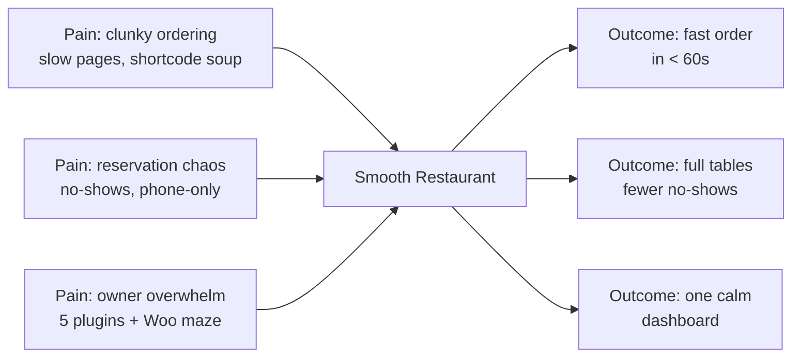

# 01 — Vision & Problem

> [!abstract] TL;DR
> **TODO(Founder):** one paragraph — what is Smooth Restaurant and why now?
> Suggested prompt: "For [owner type] who [pain], Smooth Restaurant is [category] that [outcome], unlike [incumbent]."

## Whiteboard answers (Excalidraw, 2026-09-05) ✅ imported

| Question | Answer (founder) |
|----------|------------------|
| What problem? | Making restaurant management easier and profitable |
| Who for? | People involved in the food business → see [[03-personas-jtbd]] ICP |
| How? | Features + automating existing processes |
| Why? | Existing products fall short in 2 places: (1) not agency/developer friendly, (2) not performance-centric |
| How well? | 100 on web vitals; scale to 50k users on 1 CPU / 4GB RAM |

> [!success] Positioning (from board)
> High-performance restaurant management solution for WordPress agencies and developers.
> Agency/Developer bar: full documentation, API, headless support, AI-dev support.

## North-star ^north-star

> [!question] Founder decision (proposed in [[14-ideal-product]], needs sign-off)
> `For owners who lose money to phone chaos, slow pages, and 5-plugin maze, Smooth Restaurant is the restaurant operating system for WordPress that gets menu live in <1 day and diners paid in <60s — with no commission, no hardware, you own everything, at WordPress speed.`
> - [ ] Founder approves / edits the line above

## Problem → Outcome

## Who feels it most?

| Segment | Pain intensity (1-5) | Willingness to pay (1-5) | TODO note |
|---------|----------------------|--------------------------|-----------|
| Single-location dine-in | _TODO_ | _TODO_ | |
| Takeaway / cloud kitchen | _TODO_ | _TODO_ | |
| Multi-branch / franchise | _TODO_ | _TODO_ | |

## Non-goals (say no early)

- [ ] **TODO:** e.g. "Not a POS replacement in V1"
- [ ] **TODO:** e.g. "Not a delivery-fleet app"
- [ ] **TODO:** e.g. "Not a theme"

> [!success] Founder call (2026-09-05)
> Smooth = **similar product but better in every sense** — full-suite successor to WPCafe, not a lite sibling.
> Implication: must match WPCafe breadth (menu, order, reservation) while winning on speed, UX, and onboarding.
> **TODO:** define migration path for existing WPCafe users (importer? parallel run? upgrade pricing?).
> Context: Arraytics already ships `wp-cafe` / `wpcafe-pro` (see `WPCafe/WPCafe.md`).

## Success criteria (6 months)

| Metric | Target | Source |
|--------|--------|--------|
| _TODO_ e.g. activation → first menu live | _TODO_ | |
| _TODO_ e.g. order completion rate | _TODO_ | |
| _TODO_ e.g. free→pro conversion | _TODO_ | |
