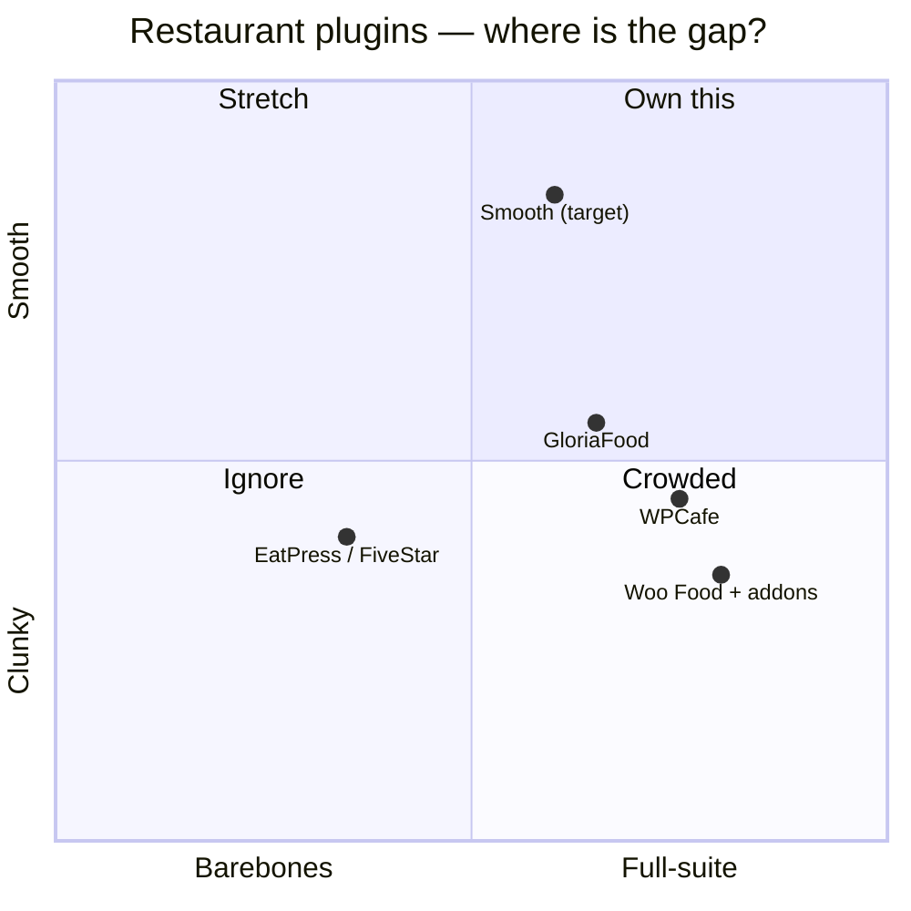
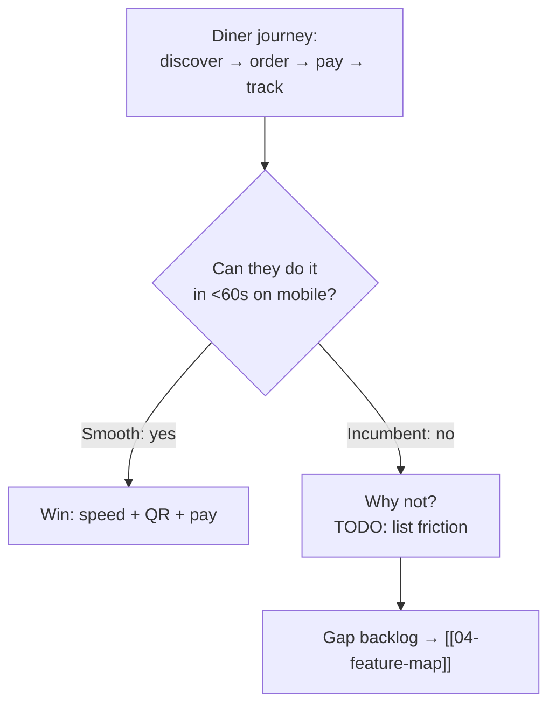

# 02 — Market & Competitors

> [!abstract] Goal
> Find the gap we can own. Tear down 3–5 incumbents, then position Smooth in one sentence.

## Positioning sketch

> [!todo] Calibrate the dots
> **TODO:** after teardowns, move each dot and justify in one line.

## Install base (wordpress.org, per ChatGPT research — re-verify before launch)

| Plugin | Active installs | Pricing signal | Strength | Weakness to exploit |
|--------|----------------|----------------|----------|---------------------|
| Five Star Reservations | 10K+ | freemium | reservations depth | ordering/ops thin |
| GloriaFood | 7K+ | free core, no commission pitch | free menu+order+reservations | hosted, WP ownership weak |
| Orderable | 5K+ | Pro ~$149/yr | polished order/delivery, date slots, ASAP | locations/QR/tips paywalled |
| WPCafe (own) | 5K+ | freemium | broad: menu/order/booking, QR, KDS alerts, tables, loyalty | heavy (~820K JS), complexity, perf fixes ongoing |
| Five Star Menu | 5K+ | freemium | menu-first simplicity | ops thin |
| RestroFood | _TODO verify_ | freemium | POS, branches, delivery, reservations, analytics | not a true recipe/food-cost system |
| DineKit / Libre Bite / FoodBook | emerging | _TODO_ | QR, KDS, POS, loyalty, waitlist, CRM appearing | Libre Bite POS online-only; offline gap open |

> [!warning] Market-share / profit caveat
> wordpress.org gives install bands, not revenue. Profit data is private. Use installs + pricing-gate analysis as proxy; do not present bands as market share. **TODO:** snapshot ratings, review counts, last-updated, support threads per competitor.

## Feature-parity snapshot

## Pricing intel (TODO)

- [ ] Capture free vs pro gates for each competitor
- [ ] Note commission / SaaS-fee traps (our wedge: **no commission**?)
- [ ] Note review volume + rating (wordpress.org) as proxy for distribution

## Our wedge (founder draft)

> [!question] One-sentence wedge
> **TODO:** e.g. "The only restaurant plugin that is fast by default, QR-first, and commission-free — live in an afternoon."

## Sources (verify before launch)

- wp.org: [GloriaFood bridge](https://wordpress.org/plugins/menu-ordering-reservations/) · [Orderable](https://wordpress.org/plugins/orderable/) · [WPCafe](https://wordpress.org/plugins/wp-cafe/) · [Five Star Reservations](https://wordpress.org/plugins/restaurant-reservations/) · [Five Star Menu](https://wordpress.org/plugins/food-and-drink-menu/)
- Pricing: [Orderable](https://orderable.com/pricing/) · [GloriaFood](https://www.gloriafood.com/pricing) · [Five Star](https://www.fivestarplugins.com/plugins/five-star-restaurant-reservations/) · [Square](https://squareup.com/us/en/point-of-sale/restaurants/pricing) · [Toast](https://pos.toasttab.com/pricing)
- Deep teardown: [[12-competitor-deep-dive]]
