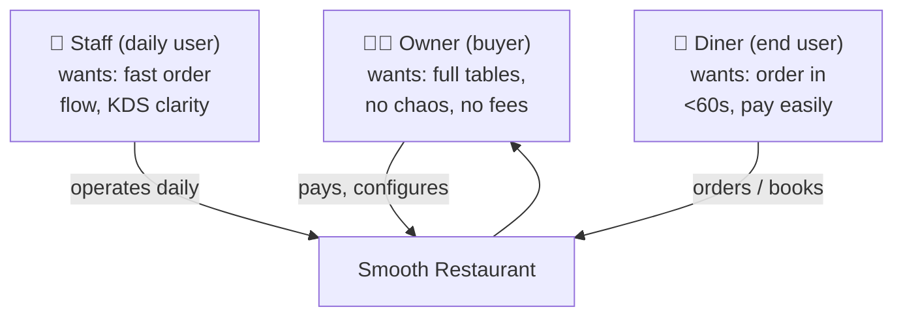
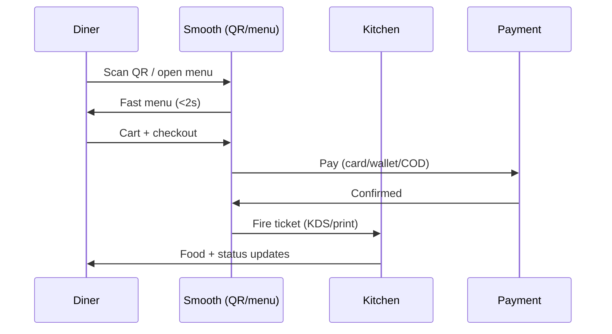

# 03 — Personas & JTBD

> [!abstract] Goal
> Name the buyer, the daily user, and the diner. If a feature serves none of them, it dies in [[04-feature-map]].

## ICP (whiteboard, 2026-09-05) ✅ imported

> Ideal Customer = anyone involved in the food business:
> i) Physical restaurant / café / food-truck owner, ii) Cloud kitchen, iii) Agency / Developer (channel + buyer).

## Persona map

## JTBD (jobs-to-be-done) — starter set, edit freely

| Who | Job | Today (painful workaround) | Success = |
|-----|-----|----------------------------|-----------|
| Owner | "Get Friday night fully booked without phone chaos" | Phone + paper + no-show | _TODO: metric_ |
| Owner | "Launch online ordering this week, no dev" | 5 plugins + Woo maze | Menu live in <1 day |
| Staff | "Fire orders to kitchen without re-typing" | Print + shout | _TODO_ |
| Diner | "Order from table by QR, pay, leave" | Wait for waiter | <60s to paid |
| Diner | "Book a table in 3 taps" | Call during rush | Instant confirm + reminder |

## Diner journey (happy path)

## Anti-personas (who we ignore in V1)

- [ ] **TODO:** e.g. delivery-fleet operators
- [ ] **TODO:** e.g. enterprise POS integrators

> [!tip] Founder check
> If torn between two features, ask: "Which persona's Friday night does this save?" Build that one.
