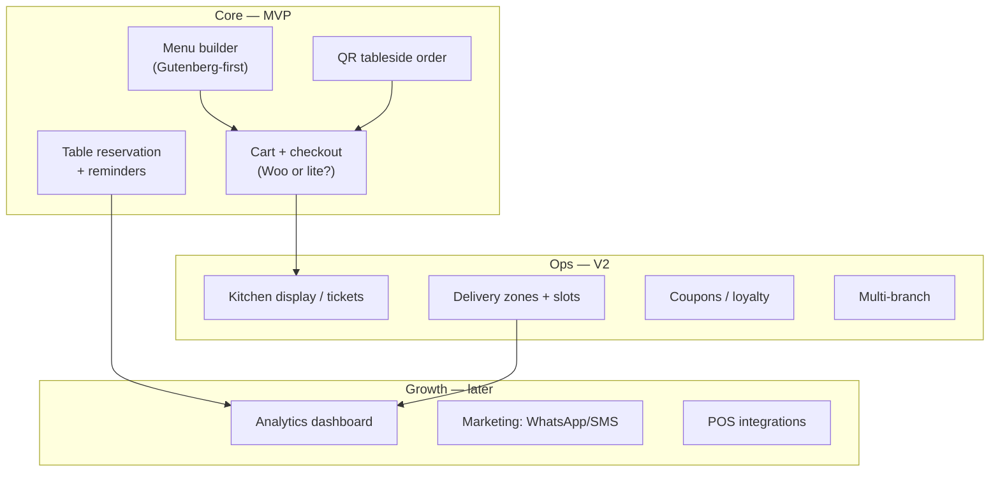
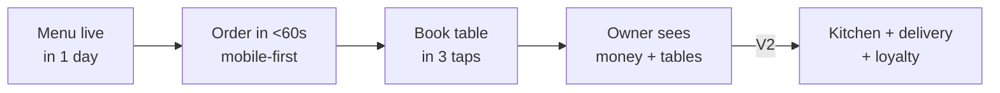

# 04 — Feature Map (MVP vs V2 vs Never)

> [!abstract] How to use
> This IS the scope decision. Move every candidate into **Must / Should / Could / Won't**.
> Rule: a Must serves a [[03-personas-jtbd|persona JTBD]] and the [[01-vision-problem#North-star|north-star]].

## Module map

## MoSCoW backlog (founder fill)

| Feature | Persona | Must/Should/Could/Won't | Free / Pro | Notes / dependency |
|---------|---------|-------------------------|------------|--------------------|
| Visual menu builder (blocks) | Owner, Diner | _TODO_ | _TODO_ | |
| Cart + checkout (fast mobile, native block) | Diner | _TODO_ | Free | standalone-native, no Woo — see [[15-standalone-strategy]] |
| Table reservation + reminders | Owner, Diner | _TODO_ | _TODO_ | no-show lever |
| QR tableside ordering | Diner, Staff | _TODO_ | _TODO_ | differentiator? |
| Pickup / delivery slots | Diner | _TODO_ | _TODO_ | |
| Payments (Stripe, PayPal, wallets, COD — native) | Diner | _TODO_ | Free core | SAQ-A, no Woo gateway — see [[15-standalone-strategy#3. Payment strategy without Woo]] |
| Kitchen tickets / KDS-lite | Staff | _TODO_ | _TODO_ | V2? |
| Coupons / happy-hour pricing | Owner | _TODO_ | _TODO_ | |
| Multi-location | Owner | _TODO_ | _TODO_ | |
| Analytics (revenue, top dishes) | Owner | _TODO_ | _TODO_ | |
| _TODO: add from ChatGPT chat_ | | | | |

## Imported roadmap (ChatGPT research, 2026-09-05) — locked direction

### P0 baseline (market parity — must ship, mostly Free)

| Feature | Free / Pro | Importance | Impact |
|---------|------------|------------|--------|
| Menu builder (categories, items, images, prices) | Free | ⭐⭐⭐⭐⭐ | acquisition core |
| Variations & add-ons | Free | ⭐⭐⭐⭐⭐ | real-menu requirement |
| Pickup + delivery ordering | Free | ⭐⭐⭐⭐⭐ | revenue workflow |
| Mobile-first checkout | Free | ⭐⭐⭐⭐⭐ | conversion |
| Opening hours / availability | Free | ⭐⭐⭐⭐⭐ | ops essential |
| Scheduled + ASAP orders | Free | ⭐⭐⭐⭐⭐ | usability edge |
| WooCommerce payments | Free | ⭐⭐⭐⭐⭐ | no payment infra |
| Order notifications / email | Free | ⭐⭐⭐⭐ | restaurant workflow |
| Order management dashboard | Free | ⭐⭐⭐⭐⭐ | usability |
| Coupons / basic discounts | Free | ⭐⭐⭐⭐ | acquisition |

### P1 differentiation + Pro engine

| Feature | Free / Pro | Importance | Impact |
|---------|------------|------------|--------|
| QR dine-in ordering | Free | ⭐⭐⭐⭐⭐ | differentiator |
| Table-based ordering | Pro | ⭐⭐⭐⭐⭐ | real restaurant system |
| Reservations | Free | ⭐⭐⭐⭐⭐ | 10K+ proven demand |
| Visual floor plan | Pro | ⭐⭐⭐⭐⭐ | competitive gap |
| Reservation deposits | Pro | ⭐⭐⭐⭐ | anti-no-show revenue |
| Delivery zones + distance fees | Free | ⭐⭐⭐⭐⭐ | high value |
| Advanced delivery rules | Pro | ⭐⭐⭐⭐ | monetizable |
| Kitchen printing | Pro | ⭐⭐⭐⭐ | web → ops bridge |
| Kitchen display (KDS) | Pro | ⭐⭐⭐⭐⭐ | future moat |
| Order status workflow | Free | ⭐⭐⭐⭐ | usability |
| Tips | Pro | ⭐⭐⭐ | revenue |
| Advanced analytics / sales+product reports | Pro | ⭐⭐⭐⭐ | retention, upsell |
| Multi-location + branch menus/hours | Pro | ⭐⭐⭐⭐⭐ | higher ARPU |
| Customer accounts / history | Free | ⭐⭐⭐⭐ | retention base |
| Loyalty / rewards | Pro | ⭐⭐⭐⭐ | differentiation |
| Order bumps / upsells | Pro | ⭐⭐⭐⭐⭐ | AOV lift |
| Abandoned-order recovery | Pro | ⭐⭐⭐⭐ | revenue recovery |
| SMS notifications | Pro | ⭐⭐⭐⭐ | ops value |
| WhatsApp notifications | Pro | ⭐⭐⭐⭐⭐ | intl appeal |
| Gift cards / marketing automation | Pro (P2) | ⭐⭐⭐ | later |

### Performance = philosophy (all tiers unless noted)

Minimal conditional JS/CSS, no Elementor dependency, lightweight UI, efficient schema, cached menus/availability, REST/AJAX only where needed, background jobs, large-menu scale, diagnostics (Pro).

## V1 slice (founder-locked)

> [!danger] Scope guardrails
> - MVP ≤ **TODO: N features**. Anything else → V2.
> - Every Must needs an **exit criterion** in [[07-roadmap-milestones]].
> - WPCafe lesson: unconditional assets + shortcode soup killed speed — see `WPCafe/WPCafe.md`. Smooth defaults: conditional load, block-first.

## Open feature questions

- [x] WooCommerce required, optional, or replaced? → **LOCKED: standalone-native** ([[15-standalone-strategy]])
- [ ] Reservation: native tables ([[15-standalone-strategy#4. Storage|D4 = custom tables]]) — confirm schema in SRS
- [ ] QR ordering: table-token + TTL row ([[15-standalone-strategy#10. Decision log|D6]]) — confirm in SRS
