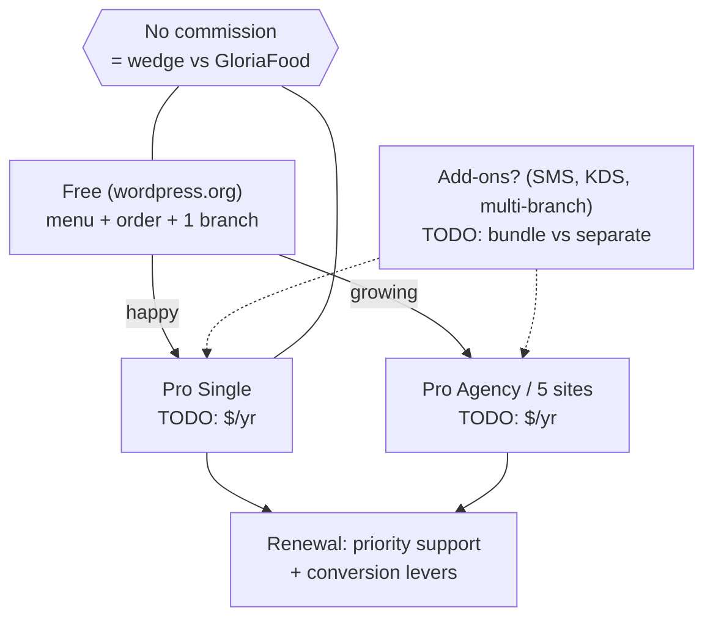
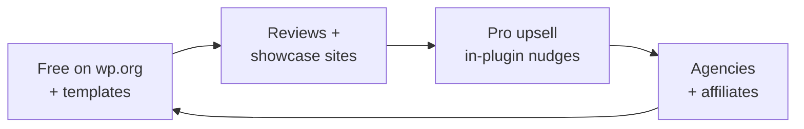

# 05 — Business Model & GTM

> [!abstract] Goal
> Decide how money flows before we scope Pro features. Packaging drives the free/pro split in [[06-technical-architecture]].

## Money flow

## Packaging draft (recommended in [[13-business-plan#5. Pricing tiers recommendation]], founder to sign)

| Tier | Price | Gets | Gate rationale |
|------|-------|------|----------------|
| Free | $0 | Menu, variations/add-ons, basic order, 1 location, reservation-lite, QR view, coupons, importer | distribution + reviews; more generous than Orderable free |
| Pro Single | $149/yr / 1 site | QR table sessions, floor-lite, deposits+reminders, bumps/tipping, receipt builder, pause/resume | price-match Orderable; win on speed + working QR |
| Pro Plus | $249/yr / 3 sites | + full floor plan, SMS/WhatsApp pack, adv. delivery, analytics | undercuts Five Star 5-site €247 |
| Pro Agency | $499/yr / 25 sites | + white-label, API/headless, priority support | agencies proved to pay (Five Star "most popular") |
| Launch LTD (optional, capped) | $299 one-time | Single-site, 1-yr support, cap 200 units | cash + reviews; sunset on schedule |

> [!question] Founder decisions
> - [ ] Approve $149 / $249 / $499 + capped $299 LTD (or set numbers) — see [[13-business-plan#Founder inputs still needed]]
> - [ ] 14-day money-back? (recommended yes)
> - [ ] Metered add-ons (SMS credits, $199 migration concierge)?

## GTM flywheel

## Launch channels (checklist)

- [ ] wordpress.org listing (screenshots, demo URL, video)
- [ ] 3 pilot restaurants (logo + testimonial rights) — **TODO: name them**
- [ ] Agency / freelancer outreach (Arraytics network)
- [ ] Content: "migrate from X in an afternoon" guides
- [ ] Lifetime / launch pricing window? **TODO**

## Unit economics (back-of-napkin)

| Input | Assumption (TODO) | Notes |
|-------|-------------------|-------|
| Free installs → active | _TODO_% | |
| Active → Pro | _TODO_% | benchmark 1–3% |
| ARPU | _TODO_ | |
| Support min / ticket | _TODO_ | prices support load |
| Churn | _TODO_ | reminders + KDS reduce? |
