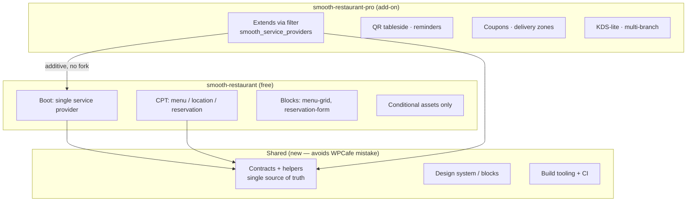
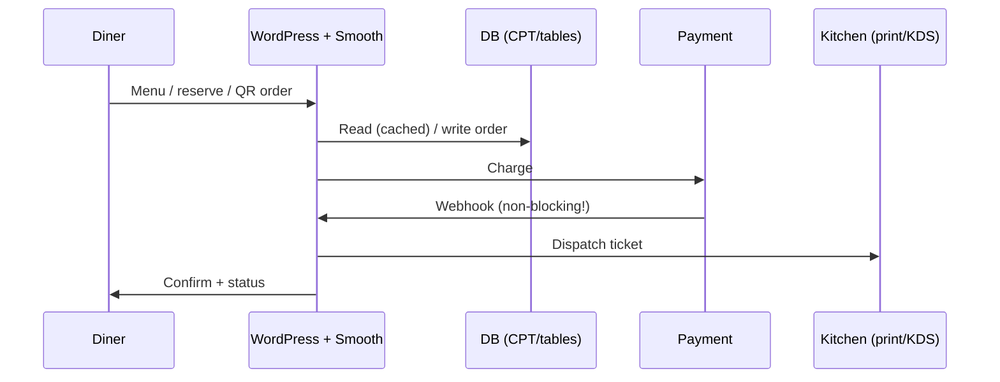

# 06 — Technical Architecture (decisions, not code)

> [!abstract] Goal
> Lock the build split early: free vs pro, Woo or lite, blocks vs shortcodes.
> Lessons from WPCafe (`WPCafe/WPCafe.md`): no shared layer = duplication tax; unconditional assets = perf tax. Smooth starts clean.

## Proposed shape

## Agency / developer bar (whiteboard, 2026-09-05) ✅ imported

Full documentation, public API, headless support, AI-dev support (hooks/filters documented per feature in the SRS).
Perf target: 100 web vitals; 50k users on 1 CPU / 4GB RAM.

## Decision log (founder + tech lead sign-off)

| # | Decision | Options | Pick | Why |
|---|----------|---------|------|-----|
| D1 | WooCommerce? | required / optional / lite-native | **native-standalone — LOCKED 2026-09-05** | kills Woo-update breakage + block-checkout fights; see [[15-standalone-strategy]] |
| D2 | Free/Pro split | shared-layer vs fork | shared-layer (recommended) | avoid WPCafe duplication |
| D3 | Builders | Gutenberg-first / Elementor / both | **Gutenberg-first, no Elementor dependency** | block-native checkout + menu; see [[14-ideal-product#4. Design system notes]] |
| D4 | Reservations storage | CPT / custom tables | **custom tables (all transactional)** | postmeta N+1 failed at WPCafe scale; see [[15-standalone-strategy#4. Storage]] |
| D5 | Payments | Woo gateway vs direct Stripe | **direct Stripe + PayPal + COD, SAQ-A** | own checkout UX; see [[15-standalone-strategy#3. Payment strategy without Woo]] |
| D6 | QR sessions | table-token + transient vs order-type | **table-token + `smooth_table_sessions` row + TTL** | transients evict; see [[15-standalone-strategy#10. Decision log]] |
| D7 | i18n / RTL / HPOS | must from day 1? | **i18n/RTL day 1; HPOS n/a (no Woo)** | WPCafe 1★ translation pain; HPOS irrelevant standalone |

## Request flow (happy path)

> [!warning] Perf budgets (WPCafe scar tissue)
> - No global enqueues — `smooth_should_load()` gate from day 1
> - Public JS+CSS budget: **TODO: e.g. <150KB** on non-Smooth pages = 0KB
> - No per-cart N+1 (memoize rules/slots per request)
> - Webhooks `blocking => false`, idempotent migrations with version guard

## Compatibility & NFRs (TODO)

- [ ] WP min / PHP min / HPOS / multisite
- [ ] Security: capability checks, nonces, SSRF-safe webhooks, rate-limit booking endpoints
- [ ] Accessibility + mobile-first (diner is on phone)
- [ ] Telemetry (opt-in): activation → menu-live → first-order funnel
