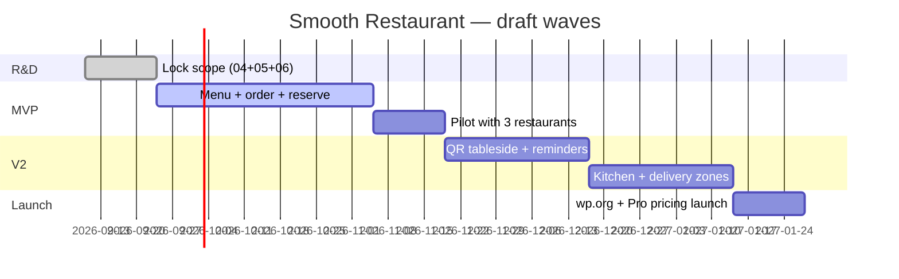
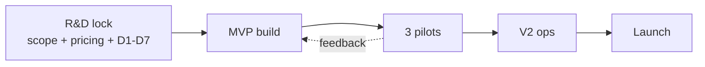

# 07 — Roadmap & Milestones

> [!abstract] Rule
> No date without an exit criterion. Each wave ends with something a founder can demo to a restaurant owner.

## Wave map

> [!todo] Fix the dates
> **TODO(Founder):** replace with real start date + team capacity. Gantt above is a placeholder shape.

## Wave detail (fill exit criteria)

| Wave | Ships | Exit criterion (demo-able) | Owner (TODO) |
|------|-------|----------------------------|--------------|
| 0 — R&D lock | This vault filled + D1–D7 decided | Founder signs [[04-feature-map]] MoSCoW + [[13-business-plan]] pricing; D1/D4/D5/D6 ✅ locked standalone | _TODO_ |
| 1 — MVP (standalone) | Native cart+block checkout, Stripe/PayPal/COD, ledger, slots, email queue, dashboard+print, reservations, QR view, importer | 1 pilot: real test payment + COD order + booking, **zero Woo installed** (per [[15-standalone-strategy#10. Decision log]]) | _TODO_ |
| 2 — Pilot | 3 live sites, onboarding <1 day | Testimonials + activation funnel data | _TODO_ |
| 3 — V2 ops | QR, reminders, coupons, delivery zones | No-show ↓, repeat order ↑ (TODO %) | _TODO_ |
| 4 — Launch | wp.org + Pro + docs + demo | _TODO_ installs + conversion in 30d | _TODO_ |

## Dependency chain

## What we deliberately defer (TODO)

- [ ] e.g. native POS hardware
- [ ] e.g. delivery-fleet tracking
- [ ] e.g. SaaS-hosted version
