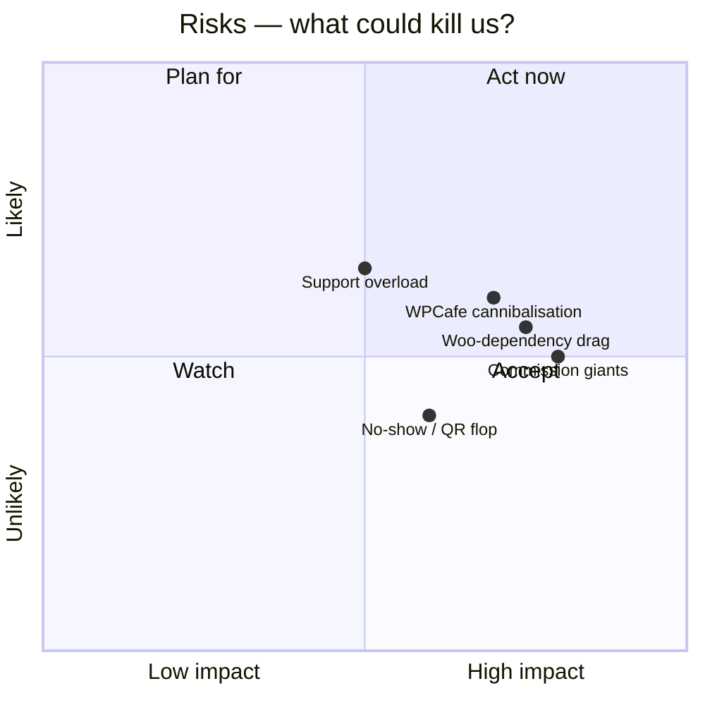

# 08 — Risks & Open Questions

> [!abstract] Living note
> Keep this open through the whole R&D. Every fear goes here with likelihood × impact and an owner + date.

## Risk radar

## Risk register (TODO)

| Risk | L × I | Mitigation | Owner | Date |
|------|-------|------------|-------|------|
| We split focus with WPCafe | _TODO_ | Decide: replace / sibling / merge (see [[01-vision-problem]]) | _TODO_ | |
| Woo-optional doubles checkout work | _TODO_ | **RESOLVED: standalone locked** ([[15-standalone-strategy]]) — risk retired, replaced by payments-build risk R1–R4 | _TODO_ | |
| Restaurants won't scan QR | _TODO_ | Pilot-measure; keep waiter-flow fallback | _TODO_ | |
| No-shows persist despite reminders | _TODO_ | Deposit / card-hold in V2? | _TODO_ | |
| Support drowns small team | _TODO_ | Onboarding wizard + docs + guardrails | _TODO_ | |

## Open questions (founder queue)

- [ ] #1 WPCafe relationship? → [[01-vision-problem]]
- [x] #2 Woo required / optional / native? → **LOCKED standalone-native**, see [[15-standalone-strategy]]
- [ ] #3 QR-first or reservation-first MVP? → [[04-feature-map]]
- [ ] #4 Single Pro vs tiers vs lifetime? → [[05-business-model-gtm]]
- [ ] #5 First 3 pilot restaurants — who? → [[07-roadmap-milestones]]
- [ ] #6 Migration messaging (WPCafe → Smooth) — needs copy + importer scope

## ChatGPT import — ✅ imported 2026-09-05

Full content triaged into [[04-feature-map#Imported roadmap]], [[09-whitespace-gaps]], [[10-marketing-plan]], and [[02-market-competitors#Install base]]. Original share link was JS-gated; pasted text is the source of truth.
