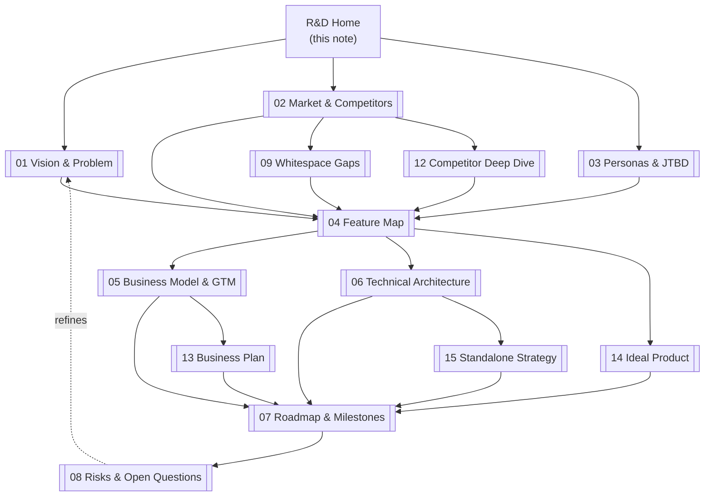

# 🍽️ Smooth Restaurant — R&D Home

> [!abstract] What this is
> Founder-level R&D vault for the **Smooth Restaurant** WordPress plugin (new build, not WPCafe).
> Goal: decide **what to build, for whom, why we win, and in what order** — before code.
> Each note below is a skeleton: fill the `TODO` sections, link decisions back here.

> [!warning] Missing input
> The ChatGPT share link (`chatgpt.com/share/6a9bbb00…`) cannot be fetched automatically (JS-gated).
> **TODO(Founder):** paste the key takeaways from that chat into [[08-risks-open-questions#ChatGPT import]] or as a new note `ChatGPT-import.md`.

## 🗺️ R&D map

## 📑 Notes

| # | Note | Question it answers |
|---|------|---------------------|
| 01 | [[01-vision-problem]] | Why does this exist? What pain dies? |
| 02 | [[02-market-competitors]] | Who else serves this? Where is the gap? |
| 03 | [[03-personas-jtbd]] | Who pays, who uses daily? |
| 04 | [[04-feature-map]] | MVP vs V2 vs never — module by module |
| 05 | [[05-business-model-gtm]] | How do we price, package, launch? |
| 06 | [[06-technical-architecture]] | Free vs Pro split, Woo dependency, blocks? |
| 07 | [[07-roadmap-milestones]] | What ships when, with what exit criteria? |
| 08 | [[08-risks-open-questions]] | What could kill this? What must we decide? |
| 09 | [[09-whitespace-gaps]] | True whitespace + 5 bets (post-correction) |
| 10 | [[10-marketing-plan]] | 10-step free→pro funnel |
| 11 | [[11-srs-process]] | Requirement → SRS → design → build (whiteboard) |
| 12 | [[12-competitor-deep-dive]] | Verified Top-5 teardown + tier/effort list |
| 13 | [[13-business-plan]] | TAM/SAM/SOM, revenue math, costs, pricing, KPIs |
| 14 | [[14-ideal-product]] | Build-toward vision: screens, budgets, anti-features |
| 15 | [[15-standalone-strategy]] | No-Woo lock: payments, ledger, importer, risks |

## 🔗 External sources

- wordpress.org stats + reviews: [Orderable](https://wordpress.org/plugins/orderable/), [WPCafe](https://wordpress.org/plugins/wp-cafe/), [GloriaFood bridge](https://wordpress.org/plugins/menu-ordering-reservations/), [Five Star Reservations](https://wordpress.org/plugins/restaurant-reservations/), [Five Star Menu](https://wordpress.org/plugins/food-and-drink-menu/)
- Pricing pages: [Orderable](https://orderable.com/pricing/) · [GloriaFood](https://www.gloriafood.com/pricing) · [Five Star](https://www.fivestarplugins.com/plugins/five-star-restaurant-reservations/) · [Square Restaurants](https://squareup.com/us/en/point-of-sale/restaurants/pricing) · [Toast](https://pos.toasttab.com/pricing)
- Dev references: [Stripe PaymentIntents](https://docs.stripe.com/payments/payment-intents) · [PayPal Orders API](https://developer.paypal.com/docs/api/orders/v2/) · [Block Editor docs](https://developer.wordpress.org/block-editor/)

## ✅ Definition of "R&D complete"

- [ ] Vision one-liner agreed (proposed in [[14-ideal-product]], needs sign-off — see [[01-vision-problem#North-star]])
- [x] Top 5 torn down with live data (see [[12-competitor-deep-dive]])
- [ ] 2–3 personas + JTBD signed off (ICP locked, see [[03-personas-jtbd#ICP]])
- [ ] MVP scope locked — MoSCoW in [[04-feature-map]] (standalone MVP drafted in [[15-standalone-strategy#5. Scope delta vs the Woo-based MVP]])
- [ ] Pricing + packaging decided (recommended $149/$249/$499 in [[13-business-plan#5. Pricing tiers recommendation]] — needs sign-off)
- [x] Build split decided: **standalone-native, D1/D3–D7 locked** in [[06-technical-architecture#Decision log]] + [[15-standalone-strategy]]
- [ ] Roadmap waves with exit criteria + owners in [[07-roadmap-milestones]]
- [ ] Business plan signed: break-even, KPIs, SLAs (see [[13-business-plan#Founder inputs still needed]])

> [!tip] How to work this vault
> 1. Fill notes 01→03 first (they constrain everything downstream).
> 2. Lock 04 (feature map) — that IS the scope decision.
> 3. Then 05+06 in parallel, then 07.
> 4. Keep [[08-risks-open-questions]] live throughout.
